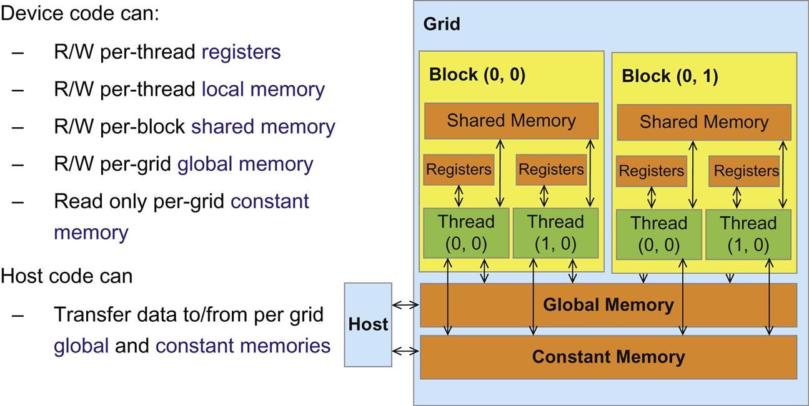
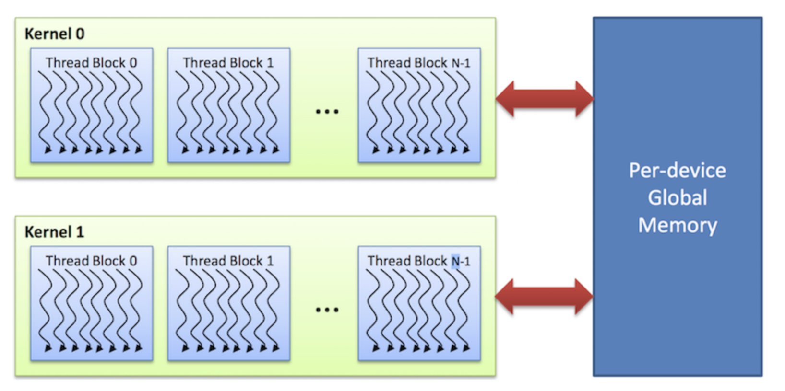
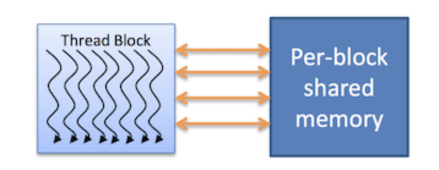
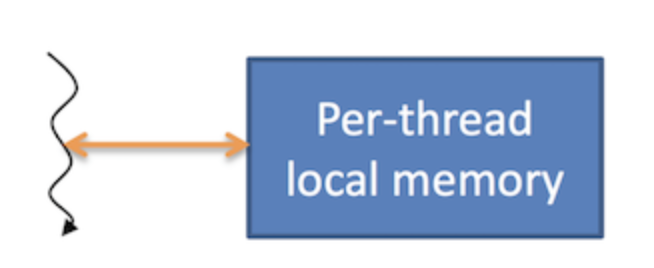
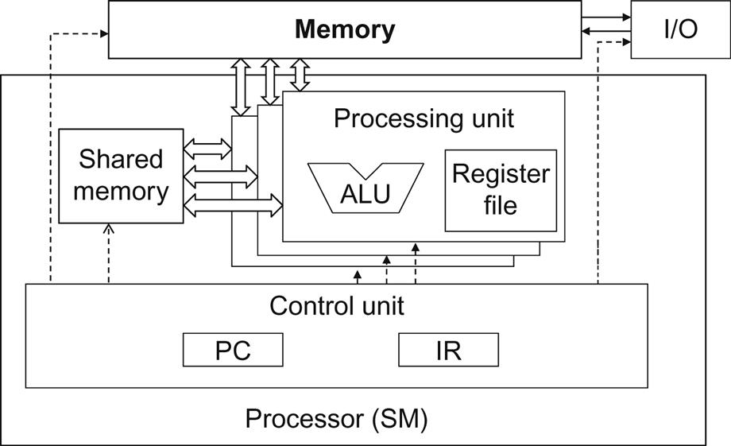

I took the [_Graphics Processing Units_](https://cs.nyu.edu/courses/fall19/CSCI-GA.3033-004/) course at NYU this past fall. This is the first post in a series about what I learnt. Buckle up for lots of technical details!

## TABLE OF CONTENTS

1. Concepts
   1. key abstractions
   1. granularity
1. CUDA Architecture
   1. kernel execution
   1. thread organization
   1. blocks
   1. SMs
   1. warp
   1. execution picture
1. Thread ID
1. Memory Hierarchy
   1. between CPU and GPU
   1. global memory
   1. shared memory
   1. local memory
   1. registers
   1. constant and texture memory
   1. principle behind the design of memory hierarchy
   1. more on the difference between shared memory and registers in a CUDA device

## Some Concepts

### three key abstractions

- a hierarchy of thread groups

- shared memories

- barrier synchronization

### granularity

- In parallel computing, granularity means the amount of **computation** in relation to **communication (or transfer) of data**.

  - fine-grained: individual tasks are small in terms of code size and execution time.

  - coarse-grained: larger amounts of computation, infrequent data communication.

- CUDA abstraction:

  - **fine-grained** data parallelism and thread parallelism nested within **roarse-grained** data parallelism and task parallelism.

  - programmers partition the problem into **coarse sub-problems** that can be solved independently in prallel by **blocks of threads** and each sub-problem into finer pieces that can be solved cooperatively in parallel by **threads within the block**.

## CUDA Architecture

### kernel execution

- Executed in parallel by an array of threads, all of which run the same code.

- Each thread has an ID which is used to compute memory addresses and make control decisions.

### thread organization - grid of blocks

- Threads are arranged as a **grid** of **blocks**.

- Blocks in a grid are completely **independent** which means they can be executed in any order, in parallel or in series.

- The independence allows thread blocks to be scheduled in _any order_ across _any number of cores_.

### block

- Threads from the same block have access to a **shared memory** .

- Execution of threads from the same block can be **synchronized** (to coordinate memory accesses).

### SMs

The CUDA architecture is built around a scalable array of multithreaded Streaming Multiprocessors.

Each SM has:

- a set of execution units
- a set of registers

- a chunk of shared memory.

### 🧐warp

Warp is the **basic unit of execution** in an NVIDIA GPU.

A warp is a collection of threads, 32 in current NVIDIA implementations.

- threads within a warp a executed simultaneously by an SM.

- multiple warps can be executed on an SM at once.

The mapping between warps and thread blocks can affect the performance of the kernel.
**It's usually good the keep the size of a block a multiple of 32**.

### picture the process of execution

1. CUDA program on the host CPU invokes a **kernel grid**

1. blocks in the grid are enumerated and distributed to SMs with available execution capacity

1. the threads of a block execute concurrently on one SM

1. as thread blocks terminate, new blocks are launched on the vacated SMs

## Thread ID

TODO

## Memory Hierarchy



### between CPU and GPU

CPU and GPU has **separate memory spaces** => data must be moved from CPU to GPU before computation starts, as well as moved back to CPU once processing has completed.

Host can **write or read** global memory and constant memory by calling API function.

(Note that device can only read constant memory. But it's short-latency and high-bandwidth)

Shared memory and registers are on-chip memories that are not visible to the host.

### global memory

1. accessible to all threads as well as the host (CPU)

1. **host** allocate and deallocate the global memory

1. data is first initialized here for the GPU to work on

1. two main challenges regarding gloabl memory:

   - long latency
   - relatively limited bandwidth

1. techniques and hardwares to deal with the limitations of global memory:

   - make use of shared memory available in SMs to reduce trips to global memory (read more about **tiling** in [The CUDA Parallel Programming Model - 7.Tiling](/cuda7-tiling))
   - more effectively move data from global memory to shared memory and registers using **coalescing** (read more about coalescing in [The CUDA Parallel Programming Model - 5. Memory Coalescing](/cuda5-coalesce))
   - use cache which automatically coalesce most of kernel access patterns (e.g. the L2 cache in Fermi and later GPUs make coaleced accesses by default)



### shared memory

1. on-chip

1. each thread block has its own

1. much faster than local or global memory

1. requires special handling to get max performance

1. only exists for the lifetime of the block



### local memory

1. on-chip

1. only exists for the lifetime of the thread

1. generally handled automatically by the **compiler**



### registers

1. each thread can only access its own registers

1. a kernel function typically uses registers to hold frequently accessed variables that are private to each thread

### constant and texture memory

read-only, accessible by all threads

- constant memory: used to cache values that are shared by all functional units.

- texture memory is optimized for texturing operations provided by the hardware

### principle behind the design of memory hierarchy

To improve **compute-to-global-memory-access ratio** and thus achieve high execution speed.

### more on the difference between shared memory and registers in a CUDA device

Although both on-chip, they differ significantly in functionality and cost of access.



#### background knowledge on how processors access different memory types

##### global memory

- off the processor chip

- implemented with DRAM technology, which implies long access latencies and relatively low access bandwidths

##### registers

- correspond to the Register File of the von Neumann model

- on-chip, which implies very short access latency and drastically higher access bandwidth compared with the global memory

- furthermore, when a variable is stored in a register, its accesses **no longer consume off-chip global memory bandwidth**. This reduced bandwidth consumption will be reflected as an increased compute-to-global-memory-access ratio.

##### how does ALU treat them differently

- each access to registers involves **fewer instructions** than an access to the global memory. Arithmetic instructions in most modern processors have “built-in” register operands.

  - For instance:
    ```c
    fadd r1, r2, r3
    ```

- meanwhile, if an operand value is in the global memory, the processor needs to perform a memory **load** operation to make the operand value available to the ALU
  - For instance:
    ```c
    load r2, r4, offset
    fadd r1, r2, r3
    ```

#### shared v.s. global

- When the processor accesses data that reside in the shared memory, it needs to perform a memory load operation, similar to accessing data in the global memory.

- However, because shared memory resides on-chip, it can be accessed with much lower latency and much higher throughput than the global memory.

#### shared v.s. registers

- Shared memory has longer latency and lower bandwidth than registers because of the need to perform a **load** operation.

- In computer architecture terminology, the shared memory is a form of _scratchpad_ memory.
