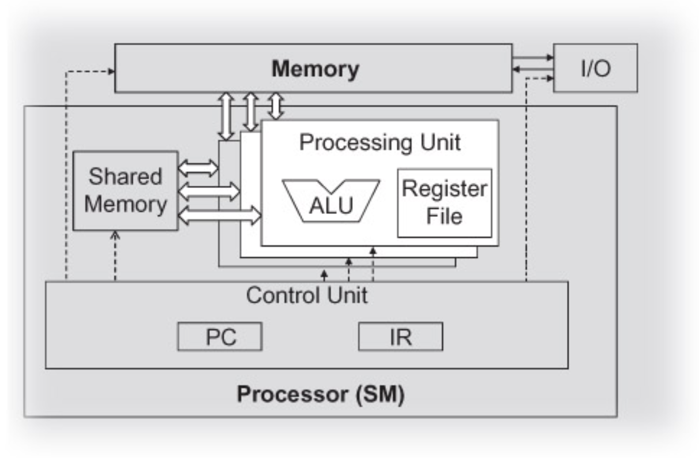
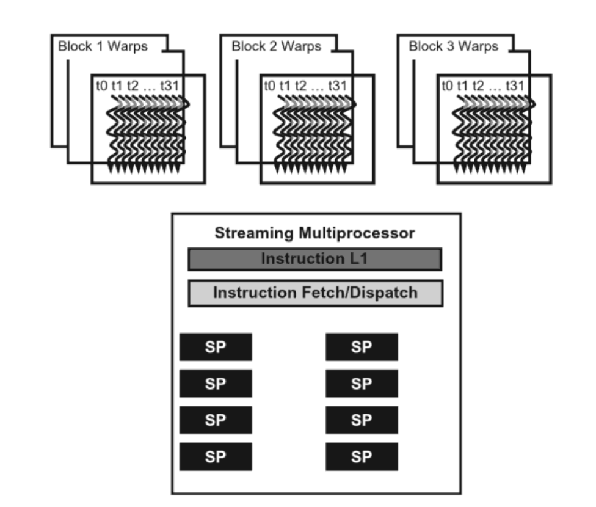
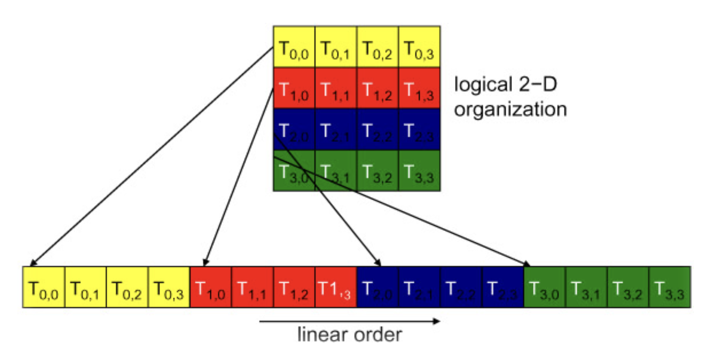

This is the second post in a series about what I learnt in my GPU class at NYU this past fall. This will be mostly about warps, why using warps from a SIMD hardware standpoint, and how warps can be a dangerous thing to deal with.

## Table of Contents

1. More About Threads
   1. Kernel threads hierarchy
   1. Synchronization of threads?
1. Warp
   1. practical reasons
   1. **SIMD hardware**
   1. practical reasons to share control unit amongst processing units
1. How Are Blocks Partitioned?
   1. 1D block
   1. 2D block
   1. 3D block
1. Warp Execution
   1. when is it good?
   1. when is it bad? **thread divergence**
      1. multipass aproach & divergence
      1. if-else example
      1. for-loop example
      1. other scenarios

## More About Threads

### Kernel threads hierarchy

Recall that launching a CUDA kernel will generate a grid of threads organized as a **two-level** hierarchy.

1. top level: a 1/2/3-dimensional array of blocks.

1. bottom level: each block consists of a 1/2/3-dimensional array of threads.

### Thread Assignment

- Threads are assigned to execution **resources** on a **block-by-block** basis.

- But the unit of thread scheduling is warp.

### Synchronization of threads?

Conceptually, threads in a block can execute in any order, just like blocks.

When an algorithm needs to execute in _phases_, **barrier synchronizations** should be used to ensure that all threads have completed a common phase before they start the next one.

But the correctness of executing a kernel should not depend on the synchrony amongst threads.

## Warp

Due to hardware cost considerations, CUDA devices currently bundle multiple threads for execution, which leads to performance limitations.

- 🧐**Each thread block is partitioned into warps** when the block is assigned to an SM.

- The warp is a unit of thread scheduling in SMs.

- Each warp consists of 32 threads of consecutive thredIdx values.

- The execution of warps is implemented by an SIMD hardware.

- Warps can be executed by the SMs in any order. No way to tell who's going to finish first.

#### practical reasons for warps

This implementation (doesn't just exist to annoy programmers) helps:

1. reducing hardware manufacturing cost

1. lower runtime operation electricity cost

1. enable coalescing of memory accesses (which will be the topic of some later post)

#### SIMD hardware

- The processor has only _one_ **control unit** that fetches and decodes instruction.

- The same control signal goes to _multiple_ **processing units**, each of which executes one of the threads in a warp.

- Since all **processing units** are controlled by the same instruction, their execution differences are due to the different operands in the **register files**.

This is called Single-Instruction-Multiple-Data in processor design.

##### practical reasons to share control unit amongst processing units

- Control units are quite complex:

  - sophisticated logic for fetching instructions

  - access ports to the instruction memory

  - on-chip instruction caches to reduce the latency of instruction fetch.

- Having multiple processing units share a control unit can result in significant reduction in hardware manufacturing cost and power consumption.

### warp as an execution unit

An SM is designed to execute all threads in a warp following the SIMD model -- at any instant in time, one instruction is fetched and executed for all threads in a warp. In the picture below, there's a single instruction fetch/dispatch shared among execution units(SPs) in th eSM. These threads will apply the same instruction to different portions of the data. Consequently, all threads in a warp will always have the **same execution timing**.

The picture also shows a number of SPs. In general:

- there are fewer SPs than the threads assigned to each SM
- each SM has only enough hardware to execute instructions from a small subset of all threads assigned to the SM at any point in time.

In early GPU designs, each SM can execute only one instruction for a single warp at any given instant.

In recent designs, each SM can execute instructions for a small number of warps at any point in time.

### latency tolerance and zero-overhead thread scheduling

In either cases from above, the hardware can execute instructions for a small subset of all warps in the SM. Then why do we have so many warps in an SM?

This is how CUDA processors efficiently execute **long-latency operations**, such as global memory accesses.

When an instruction to be executed by a warp needs to wait for the result of a previously initiated long-latency operation, the warp is not selected for execution. **Instead, another resident warp that is no longer waiting for results will be selected for execution**. If more than one warp is ready for execution, a priority mechanism is used to select one for execution. (see more about warps' 0-cost context switch in [Some CUDA Related Questions](/cudaRandom)).

This mechanism of filling the latency time of operations with work from other threads is often called **“latency tolerance”** or “latency hiding” (see “Latency Tolerance” sidebar).

Warp scheduling is also used for tolerating other types of operation latencies, such as pipelined floating-point arithmetic and branch instructions. **Given a sufficient number of warps, the hardware will likely find a warp to execute at any point in time**, thus making full use of the execution hardware in spite of these long-latency operations.

The selection of ready warps for execution **avoids introducing idle or wasted time** into the execution timeline, which is referred to as **zero-overhead thread scheduling**. With warp scheduling, the long waiting time of warp instructions is “hidden” by executing instructions from other warps.

**This ability to tolerate long-latency operations is the main reason GPUs do not dedicate nearly as much chip area to cache memories and branch prediction mechanisms as do CPUs**. Thus, GPUs can dedicate more of its chip area to floating-point execution resources.

## How Are Blocks Partitioned?

Based on thread indices. Thread IDs within a warp are consecutive and increasing.

1. Example with _1D thread block_:

   - only threadIdx.x is used, threadIdx.x values within a warp are consecutive and increasing.

   - for a warp size of 32:

     - warp 0: thread 0 ~ thread 31

     - warp 1: thread 32 ~ thread 63

     - warp n: thread 32 × n ~ thread 32(n + 1) - 1

   - for a block of which the size is not a multiple of 32:
     - the last warp will be **padded with extra threads** to fill up the 32 threads.

1. _2D thread block_:

   - the dimensions will be _projected into a linear order_ **before** partitioning into warps

   

   - determine the linear order: place the rows with larger y and z coordinates after those with lower ones.

1. _3D thread block_:

   - first place all threads of which the threadIdx.z value is 0 into the linear order. Among these threads, they are treated as a 2D block as shown in above picture

   - example: a 3D thread block of dimensions 2 × 8 × 4

     - total 64 threads

     - warp 0: T(0,0,0) ~ T(0,7,3)

     - warp 1: T(1,0,0) ~ T(1,7,3)

## Warp Execution

All threads of a warp are executed by the SIMD hardware as a bundle, where the same instruction is run for all threads.

Warp is the unit of **thread scheduling** in SMs.

### when is it good?

When all threads within a warp follow the same control flow.

For example, for an if-else construct, the execution works well when either all threads execute the if part or all execute the else part.

### when is it bad?

When threads within a warp take different control flow paths, the SIMD hardware will take _multiple passes_ through these divergent paths. During each pass, the threads that follow the other path are not allowed to take effect.

These passes are _sequential_ to each other, thus they will add to the execution time.

#### multipass aproach & divergence

- The **multipass approach** to **divergent warp execution** extends the SIMD hardware's ability to implement the full semantics of CUDA threads. While the hardware executes the same instruction for all threads in a warp, it selectively lets the threads take effect in each pass only, allowing every thread to take its own control flow path. This preserves the independence of threads while taking advantage of the reduced cost of SIMD hardware.

- When threads _in the same warp_ follow different paths of control flow, we say that these threads **diverge** in their execution.

#### if-else example

In the if-else example, divergence arises if some threads in a warp take the then path and some the else path. The cost of divergence is the _extra pass_ the hardware needs to take to allow the threads in a warp to make their own decisions.

#### for-loop example

If threads in a warp execute a for loop that can iterate **six, seven, or eight** times for different threads:

- All threads will finish the first six iterations together.
- Two passes will be used to execute the seventh iteration, one for those that take the iteration and one for those that do not.
- Two passes will be used to execute the eighth iteration, one for those that take the iteration and one for those that do not.

#### other scenarios

In terms of source statements, a control construct can result in thread divergence when its decision condition is based on threadIdx values.

For example, the statement `if (threadIdx.x. > 2) {}` causes the threads to follow two divergent control flow paths. Threads 0, 1, and 2 follow a different path than threads 3, 4, 5, etc.

Similarly, a loop can cause thread divergence if its loop condition is based on thread index values.
