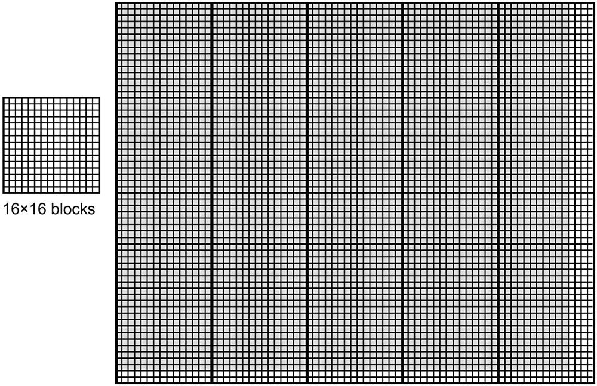
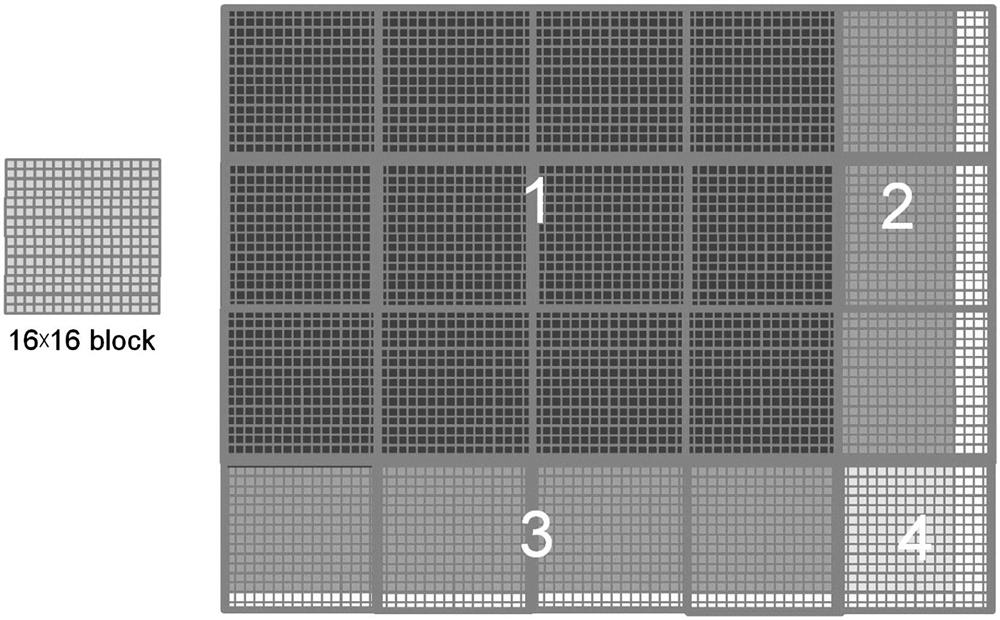

This is the third post in a series about what I learnt in my GPU class at NYU this past fall. Here I dive a bit deeper than the previous post into thread divergence.

## Using Control Construct with Thread Divergence

A prevalent reason for using a control construct with thread divergence is **handling boundary conditions** when mapping threads to data.

- This is usually because the _total number of threads_ needs to be a _multiple of the block size_ whereas the size of the data can be an arbitrary number.

#### example of a vector addition kernel

In the vector addition kernel below, there's an if `(i<n)` statement in addVecKernel.
This is because not all vector lengths can be expressed as multiples of the block size.

```c
// Compute vector sum C = A+B
// Each thread performs one element-wise addition
__global__ vecAddKernel(){
     int i = blockDim.x * blockIdx.x + threadIdx.x;
     if(i < n) C[I] = A[I] + B[1];
}
```

For example, assume that:

- vector length is 1003
- block size is 64

To process all the 1003 vector elements:

- 16 thread blocks are launched
- the total number of threads in these blocks would be 1024 threads
- the last 21 threads in thread block 15 need to be disabled
- these 16 blocks are partitioned into 32 warps, **only the last warp will have control divergence**.

## Measure Performance Impact

The performance impact of control divergence decreases with the **size** of the vectors being processed.

- For a vector length of 100, one of the four warps will have control divergence, which can have significant impact on performance.

- For a vector size of 1000, only one out of the 32 warps will have control divergence. That is, control divergence will affect only about 3% of the execution time. Even if it doubles the execution time of the warp, the net impact to the total execution time will be about 3%.

- Obviously, if the vector length is 10,000 or more, only one of the 313 warps will have control divergence. The impact of control divergence will be much less than 1%!

### 2D blocks example

For two-dimensional data, if-statements are also used to handle the boundary conditions for threads that operate at the edge of the data.

#### settings

- given a block size of 16 x 16



- data to be processed is of the size 76×62

#### map data to blocks then warps

- 20 = 5\*4 **blocks** will be used

- each block will be partitioned into 8 **warps** (16 \* 16 / 32), each one consists of two rows of a block

- there are a total 160 warps (8 warps per block) involved

#### measure performance impact of control divergence

- none of the warps in the 12 blocks (12\*8 = 96 warps) in region 1 will have control divergence.



- for region 2, all the (3 \* 8 = 24) warps will have control divergence.

- for region 3, note that all the bottom warps are mapped to data that are completely outside the picture. As a result, **none of them will pass the if-condition** 🙀. (If the picture had an odd number of pixels in the vertical dimension, these warps would have had control divergence). Since they all follow the same control flow path, none of these 32 warps will have control divergence!

- for region 4, the first 7 warps will have control divergence but the last warp will not.

All in all, 31 out of the 160 warps will have control divergence.

#### increase the horizontal dimension of data

Once again, the performance impact of control divergence decreases as the number of data in the horizontal dimension increases.

For example, if we process some data of size 200×150 with 16×16 blocks, there will be a total `130 =13*10` thread blocks or 1040 warps. The number of warps in regions 1 through 4 will be `864 (12*9*8)`, `72 (9*8)`, `96 (12*8)`, and `8 (1*8)`. Only 80 of these warps will have control divergence. Thus, the performance impact of control divergence will be less than 8%.
