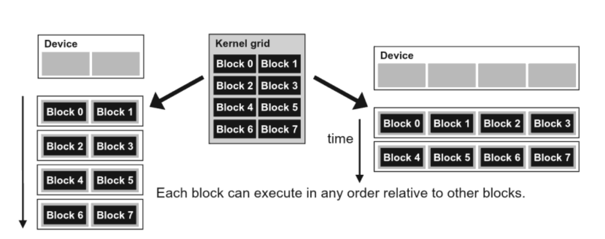

This is the fourth post in a series about what I learnt in my GPU class at NYU this past fall. Here I talk about barrier synchronization, how CUDA ensures the temporal proximity of threads within a block, and transparant scalability. Also collected here are several examples that showcase how the CUDA `__syncthreads()` command should (or should not) be used.

## Some Notes On Synchronization

### barrier synchronization

To coordinate the execution of multiple threads, CUDA allows threads in the same block to coordinate their activities by using a barrier synchronization function `__syncthreads()`. This process ensures that all threads in a block have completed a phase of their execution of the kernel before any of them can proceed to the next phase.

- `__syncthreads()` is called by a kernel function

- The thread that makes the call will be held at the calling location until **every thread in the block** reaches the location

- Threads in different blocks **cannot** synchronize! CUDA runtime system can execute blocks in any order.

Barrier synchronization is a simple and popular method for coordinating parallel activities.

### resources assignment and temporal proximity of threads

CUDA also assigns execution resources to all threads in a block as a unit. A block can begin execution only when the runtime system has secured all resources needed for all threads in the block to complete execution. All threads in the same block are assigned the same resources.

This condition ensures the temporal proximity of all threads in a block and prevents excessive or indefinite waiting time during barrier synchronization

### transparent scalability

The above leads to an important tradeoff in the design of CUDA barrier synchronization. By **not allowing** threads in **different blocks** to perform barrier synchronization with each other, the CUDA runtime system can **execute blocks in any order** relative to each other because none of them need to wait for each other. This flexibility enables scalable implementations shown in the figure below.



- In a low-cost systenm with only a few execution resources, one can execute a small number of blocks simultaneously (left-hand-side).
- In a high-end implementaion, one can execute a large number of blocks simultaneously (right-hand-side).

This ability to execute the same application code on hardware with different numbers of execution resources is referred to as **transparent scalability**, which reduces the burden on application developers and improves the usability of applications.

## Example 1

```c
__shared__ float partialSum[SIZE];
partialSum[threadIdx.x] = X[blockIdx.x * blockDim.x + threadIdx.x];
unsigned int t = threadIdx.x;
for(unsigned int stride = 1; stride < blockDim.x; stride *= 2){
     __syncthreads();
     if(t % (2*stride) == 0)
          partialSum[t] += partialSum[t+stride];
}
```

The `__syncthreads()` statement in the for-loop ensures that all partial sums for the previous iteration have been generated and before any one of the threads is allowed to begin the current iteration. This way, all threads that enter the second iteration will be using the values produced in the first iteration.

## Example 2

How to sync threads when there's **thread divergence**?

`__syncthreads()` is a barrier statement in CUDA, where if it's present, **must be executed by all threads in a block**.

- When a `__syncthreads()` statement is placed in an if-statement, either all or none of the threads in a block execute the path that includes the `__syncthreads()`.

- For an `if-then-else` statement, if each path has a `__syncthreads()` statement, either all threads in a block execute the `then-path` or all execute the `else-path`. Because the two `__syncthreads()` are different barrier synchronization points. If a thread in a block executes the `then-path` and another executes the `else-path`, they would be waiting at different barrier synchronization points and end up waiting for each other forever.

The code below is problematic because of exactly the above reason. Some threads will be stuck in the `if` branch whereas others in the `else` branch -- deadlock!

```c
if{
     ...
     __syncthreads();
}else{
     ...
     __syncthreads();
}
```

To fix it is simple:

```c
if{
     ...
}else{
     ...
}
__syncthreads();
```
