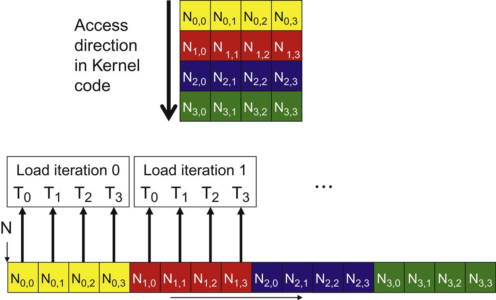
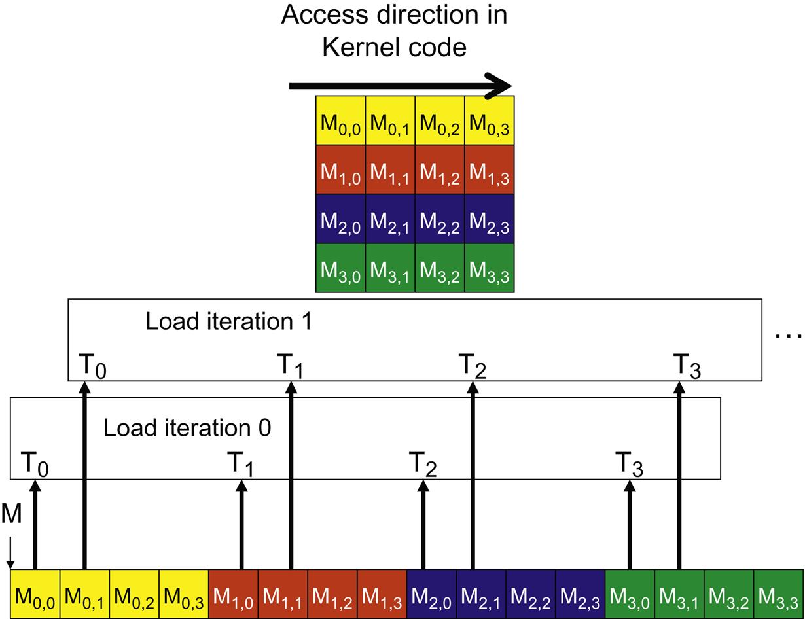
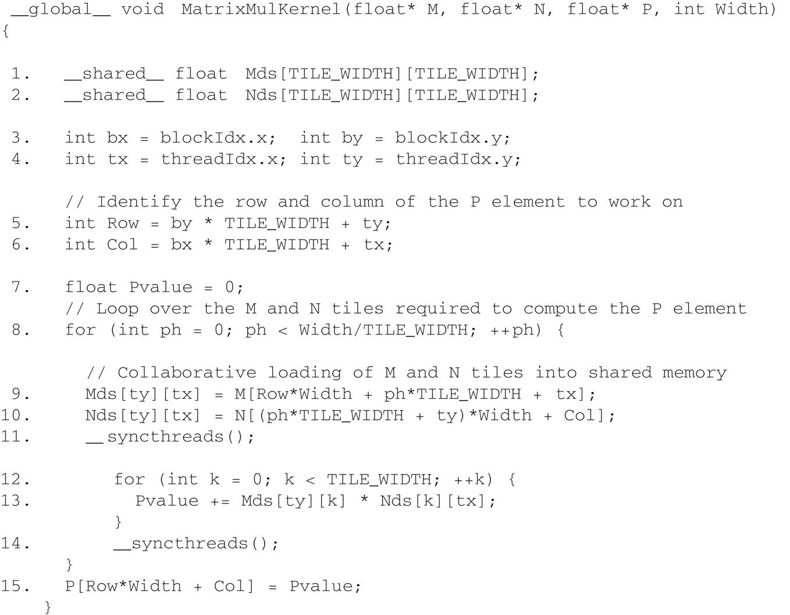

This post talks about a key factor to CUDA kernel performace: accessing data in the globle memory.

CUDA applications tend to process a massive amount of data from the global memory within a short period of time.

**Tiling** techniques are engineered that utilize **shared memories** to reduce the total amount of data that must be acessed from the global memory (read about tiling techniques here [The CUDA Parallel Programming Model - 6.Tiling](/cuda6-tiling)).

I this post we talk about **memory coalescing** techniques that can more effectively move data from the global memory into **shared memories and registers**.

Memory coalescing techniques are often used _in conjunction with tiling techniques_ to allow CUDA devices to reach their performance potential by more efficiently utilizing the global memory bandwidth.

## Global Memory Bandwidth

The global memory of a CUDA device is implemented with DRAMs.

#### DRAM is slow

Data bits are stored in DRAM cells that are small capacitors, where the presence or absence of a _tiny amount of electrical charge_ distinguishes between 0 and 1.

Reading data from a DRAM cell requires the small capacitor to use its tiny electrical charge to drive a highly capacitive line leading to a sensor and set off its detection mechanism that determines whether a sufficient amount of charge is present in the capacitor to qualify as a “1”. This process takes 10 s of nanoseconds in modern DRAM chips. **This is in sharp contrast with the sub-nanosecond clock cycle time of modern computing devices**.

#### parallelism and memory access throughput

Because this is a very slow process relative to the desired data access speed (sub-nanosecond access per byte), modern DRAMs **use parallelism to increase their rate of data access**, commonly referred to as _memory access throughput_.

#### DRAM bursts

Each time a DRAM location is accessed, **a range of consecutive locations that includes the requested location are actually accessed**.

Many sensors are provided in each DRAM chip and they work in parallel. Each senses the content of a bit within these consecutive locations.

Once detected by the sensors, the data from all these consecutive locations can be transferred at very high-speed to the processor. These consecutive locations accessed and delivered are referred to as **DRAM bursts**.

#### motivation

If an application makes focused use of data from these bursts, the DRAMs can supply the data at a much higher rate than if a truly random sequence of locations were accessed.

## Memory Coalescing

Current CUDA devices employ a technique that allows the programmers to achieve high global memory access efficiency by **organizing memory accesses of threads into favorable patterns**.

### how?

- This technique takes advantage of the fact that **threads in a warp execute the same instruction at any given point in time**.

- The most favorable access pattern is achieved when all threads in a warp access consecutive global memory locations.

- When all threads in a warp execute a load instruction, the hardware detects whether they access consecutive global memory locations. If that's the case, the hardware combines (**coalesces**) all these accesses into a consolidated access to consecutive DRAM locations.

- For example, for a given load instruction of a warp, if thread 0 accesses global memory location N2, thread 1 location N+1, thread 2 location N+2, and so on, all these accesses will be coalesced into a single request for consecutive locations when accessing the DRAMs.

- Such coalesced access allows the DRAMs to deliver data as a burst.

### matrix multiplication example

Recall from [The CUDA Parallel Programming Model - 2. Warps](/cuda2-warp) that multidimensional array elements in CUDA are placed into the linearly addressed memory space according to the **row-major** convention.

Say we have a kernel that computes `M x N`, where both M and N are 2D row-major array.

Each thread accesses a row of the M array (matrix A below) and a column of the N array (matrix B below).

### IMPORTANT: hope this helps with understanding the patterns below

Coalesce happens amongst threads, not amongst different iterations of the loop within each thread's execution.

You might be thinking: for matrix M in the example below, each thread will read the whole row within its for-loop. But it's not how the coalesce hardware works here.

Because:

- if you look across the threads in matrix M, they don't share row accesses at all.
- whereas for matrix N, each thread at iteration 0 combined will access the entire row 0.

Since all threads within a warp executes the same instruction, they all execute the same iteration in the loop at any time. So it doesn't matter if a thread reads through an entire row during its lifetime. What matters is that all the threads of a warp can be coalesced during each (collected) memory access.

#### patterns


#### **M: unfavorable data access pattern**

- fig.(A) above illustrates the data access pattern of the M array
- threads in a warp read adjacent rows
- during iteration 0, threads in a warp read **element 0** of rows 0 through 31.
- during iteration 1, these same threads read **element 1** of rows 0 through 31.
- **None** of the accesses will be coalesced.

#### **N: favorable data access pattern**

- fig.(B) above illustrates the data access pattern of the N array

- each thread reads a column of N.

- during iteration 0, threads in warp 0 read **element 1** of columns 0 through 31.

- all these accesses will be coalesced.

If the above doesn't make sense to you 🧐, read the post on the matrix application kernel here: [CUDA Programming Examples - 1. Matrix Multiplication](/cuda7-matrixmult)

#### a coalesced access pattern -- e.g. N



- The arrow in the top portion of the figure shows the access pattern of the kernel code.

Recall the for-loop in the kernel:

```c
__global__ void MatrixMulKernel (float* M, float* N, float* P, int Width){
    // calculate the row index of the P element and M
    int Row = blockIdx.y * blockDim.y + threadIdx.y;
    // calculate the col index of the P element and N
    int Col = blockIdx.x * blockDim.x + threadIdx.x;

    if((Row < Width) && (Col < Width>)){
        float Pvalue = 0;
        //each thread computes one element of the block sub-matrix
        for(int k = 0; k < Width; k++) {
            Pvalue += M[Row*Width + k] * N[k*Width + Col];
        }
        P[Row * Width + Col] = Pvalue;
    }
}
```

- Within a given iteration of the `k` loop, the `k*Width` value is the same across all threads. Recall that `Col=blockIdx.x*blockDim.x+threadIdx.x`.

- Since the value of blockIndx.x and blockDim.x are of the same value for all threads in the same block, the only part of `k*Width+Col` that varies across a thread block is threadIdx.x.

- Since **adjacent threads** have consecutive threadIdx.x values, their accessed elements will have consecutive addresses.

In the pictured example, we are using only 1 block to calculate the entire P matrix, where:

- block size: 4 \* 4
- warp size: 4
- `Width = 4`
- `blockDim.x = 4`
- `blockIdx.x = 0`

- In `iteration 0`, the k value is 0. The index used by each thread for accessing N is

  ```c
  N[k * Width + Col] = N [k * Width + blockIdx.x * blockDim.x + threadIdx.x]
                     =N[0 * 4 + 0 * 4 + threadidx.x]
                     =N[threadIdx.x]
  ```

  That is, within this thread **block**, the index for accessing N is simply the value of threadIdx.x. The N elements accessed by `T0, T1, T2, T3` are `N[0], N[1], N[2], and N[3]`. This is illustrated with the `“Load iteration 0”` box of the above figure.

  These elements are in consecutive locations in the global memory. The hardware detects that **these accesses are made by threads in a warp and to consecutive locations in the global memory**. It coalesces these accesses into a consolidated access. This allows the DRAMs to supply data at a high rate.

- In `iteration 1`, similarly:
  ```c
  N[k * Width + Col] = N[k * Width + blockIdx.x * blockDim.x + threadIdx.x]
                     = N[1 * 4 + 0 * 4 + threadidx.x]
                     = N[4 + threadIdx.x]
  ```
  The N elements accessed by `T0, T1, T2, T3` in this iteration are `N[5], N[6], N[7], and N[8]`, as shown with the “Load iteration 1” box.

#### an un-coalesced access pattern -- e.g. M



- The arrow in the top portion of the figure shows that the kernel code for **each thread** accesses elements of a row in sequence

- block size: 4 \* 4
- warp size: 4
- `Width = 4`
- `blockDim.y = 4`
- `blockIdx.y = 0`
- The index used by each thread for accessing M is:

  ```c
  M[Row * Width + k]  =M[(blockIdx.y * blockDim.y + threadIdx.y) * Width + k]

                      =M[((0 * 4+  threadIdx.y) * 4 + 0]

                      =M[threadIdx.x * 4]
  ```

- The M elements accessed by `T0, T1, T2, T3` are `M[0], M[4], M[8], and M[12]`, as shown with the “Load iteration 0” box in the above figure. These elements are not in consecutive locations in the global memory. The hardware cannot coalesce these accesses into a consolidated access.

## Corner Turning

What if we have to iterate through data along the row direction?

- We can use the shared memory to enable memory coalescing -- this is the technique called corner turning

### how?

- Use a tiled algorithm
- Threads of a block can first cooperatively load the tiles into the shared memory
- Care must be taken to ensure that these tiles are loaded in a coalesced pattern
- Once the data is in shared memory, they can be accessed either on a row basis or a column basis with much less performance variation because the shared memories are implemented as intrinsically high-speed on-chip memory that does not require coalescing to achieve high data access rate.

- A tiled matrix multiplication kernel is shown below:
  
