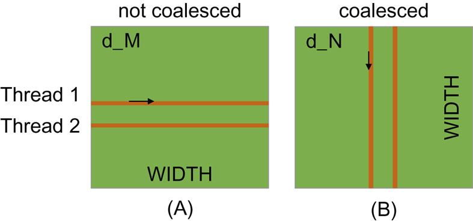

This post talks about a key factor to CUDA kernel performace: accessing data in the globle memory.

CUDA applications tend to process a massive amount of data from the global memory within a short period of time.

**Tiling** techniques are engineered that utilize **shared memories** to reduce the total amount of data that must be acessed from the global memory (read about tiling techniques here [The CUDA Parallel Programming Model - 6.Tiling](/cuda6-tiling)).

I this post we talk about **memory coalescing** techniques that can more effectively move data from the global memory into **shared memories and registers**.

Memory coalescing techniques are often used _in conjunction with tiling techniques_ to allow CUDA devices to reach their performance potential by more efficiently utilizing the global memory bandwidth.

## Global Memory Bandwidth

The global memory of a CUDA device is implemented with DRAMs.

#### DRAM is slow

Data bits are stored in DRAM cells that are small capacitors, where the presence or absence of a _tiny amount of electrical charge_ distinguishes between 0 and 1.

Reading data from a DRAM cell requires the small capacitor to use its tiny electrical charge to drive a highly capacitive line leading to a sensor and set off its detection mechanism that determines whether a sufficient amount of charge is present in the capacitor to qualify as a “1”. This process takes 10 s of nanoseconds in modern DRAM chips. **This is in sharp contrast with the sub-nanosecond clock cycle time of modern computing devices**.

#### parallelism and memory access throughput

Because this is a very slow process relative to the desired data access speed (sub-nanosecond access per byte), modern DRAMs **use parallelism to increase their rate of data access**, commonly referred to as _memory access throughput_.

#### DRAM bursts

Each time a DRAM location is accessed, **a range of consecutive locations that includes the requested location are actually accessed**.

Many sensors are provided in each DRAM chip and they work in parallel. Each senses the content of a bit within these consecutive locations.

Once detected by the sensors, the data from all these consecutive locations can be transferred at very high-speed to the processor. These consecutive locations accessed and delivered are referred to as **DRAM bursts**.

#### motivation

If an application makes focused use of data from these bursts, the DRAMs can supply the data at a much higher rate than if a truly random sequence of locations were accessed.

## Memory Coalescing

Current CUDA devices employ a technique that allows the programmers to achieve high global memory access efficiency by **organizing memory accesses of threads into favorable patterns**.

### how?

- This technique takes advantage of the fact that **threads in a warp execute the same instruction at any given point in time**.

- The most favorable access pattern is achieved when all threads in a warp access consecutive global memory locations.

- When all threads in a warp execute a load instruction, the hardware detects whether they access consecutive global memory locations. If that's the case, the hardware combines (**coalesces**) all these accesses into a consolidated access to consecutive DRAM locations.

- For example, for a given load instruction of a warp, if thread 0 accesses global memory location N2, thread 1 location N+1, thread 2 location N+2, and so on, all these accesses will be coalesced into a single request for consecutive locations when accessing the DRAMs.

- Such coalesced access allows the DRAMs to deliver data as a burst.

### how to effectively use the coalescing hardware?

Recall from [The CUDA Parallel Programming Model - 2. Warps](/cuda2-warp) that multidimensional array elements in CUDA are placed into the linearly addressed memory space according to the **row-major** convention.

#### matrix multiplication example

Say we have a kernel that computes `M x N`, where both M and N are 2D row-major array.

Each thread accesses a row of the M array (matrix A below) and a column of the N array (matrix B below).

##### **M: unfavorable data access pattern**

- fig.(A) above illustrates the data access pattern of the M array
- threads in a warp read adjacent rows
- during iteration 0, threads in a warp read **element 0** of rows 0 through 31.
- during iteration 1, these same threads read **element 1** of rows 0 through 31.
- **None** of the accesses will be coalesced.

##### **N: favorable data access pattern**

- fig.(B) above illustrates the data access pattern of the N array

- each thread reads a column of N.

- during iteration 0, threads in warp 0 read **element 1** of columns 0 through 31.

- all these accesses will be coalesced.

If the above doesn't make sense to you 🧐, read the post on the matrix application kernel here: [CUDA Programming Examples - 1. Matrix Multiplication](/cuda7-matrixmult)
