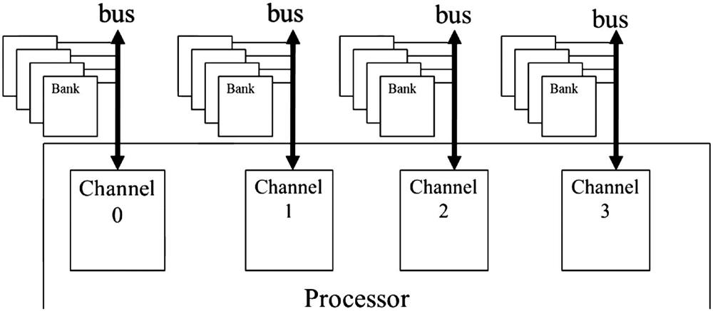
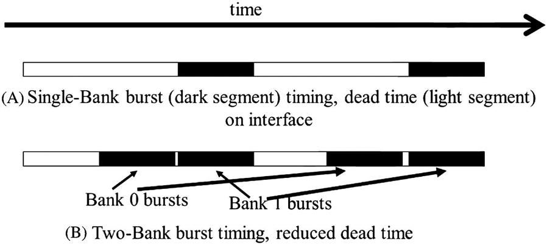

The **compute-to-global-memory-access** ratio has major implications on the performance of a CUDA kernel. Programs whose execution speed is limited by memory access throughput as memory-bound programs.

## Memory as a Limiting Factor to Parallelism

### the more the thread requires, the fewer of them can run in parallel

While CUDA registers and shared memory can be extremely effective in reducing the number of accesses to global memory, one must be careful to stay within the capacity of these memories. These memories are forms of resources necessary for thread execution. Each CUDA device offers limited resources, thereby **limiting the number of threads that can simultaneously reside in the SM for a given application**.

In general, **the more resources each thread requires, the fewer the threads that can reside in each SM, and likewise, the fewer the threads that can run in parallel in the entire device**.

### register usage and the level of parallelism

To illustrate the interaction between **register usage of a kernel** and the **level of parallelism** that a **device** can support, assume that in a current-generation device where each SM can accommodate up to:

- 1536 threads
- 16,384 registers

While 16,384 is a large number, each thread is only allowed to use a very limited number of registers, considering the number of threads that can reside in each SM.

To support 1536 threads, **each thread** can use only `16,384/1536 =10` registers. If each thread uses 11 registers, the number of threads that can be executed concurrently in each SM will be reduced.

Such reduction occurs at the **block granularity** e.g., if each block contains 512 threads, the reduction of threads will be accomplished by **reducing 512 threads at a time**!

Thus, the next smaller number of threads from 1536 will be 1024, indicating a 1/3 reduction of threads that can simultaneously reside in each SM.

This procedure can substantially reduce the number of warps available for scheduling, thereby decreasing the ability of the processor to find useful work in the presence of long-latency operations (see more about warp scheduling in [Recap: GPU Latency Tolerance and Zero-Overhead Thread-Scheduling](/cudaRandom-latency) and [The CUDA Parallel Programming Model - 2. Warps](/cuda2-warp)).

### shared memory usage and the level of parallelism

Shared memory usage can also limit the number of threads assigned to each SM.

As an example, we assume that:

- a device has `16,384 (16K)` bytes of shared memory, allocated to thread blocks, in each SM.
- each SM can accommodate up to 8 blocks.

To reach this maximum, each block must **not use more than 2K bytes of shared memory**; otherwise, the number of blocks that can reside in each SM is reduced such that the total amount of shared memory used by these blocks does not exceed 16K bytes.

For instance, if each block uses 5K bytes of shared memory, no more than three blocks can be assigned to each SM.

For the tiled matrix multiplication example ([The CUDA Parallel Programming Model - 7.Tiling](/cuda7-tiling)), shared memory can become a limiting factor. For a tile size of 16×16, each block needs 16×16×4=1K bytes of storage for `Mds`. (Note that each element is a float type, which is 4 bytes.) Another 1KB is needed for `Nds`. Thus, each block uses 2K bytes of shared memory. The 16K-byte shared memory allows 8 blocks to simultaneously reside in an SM. Since this is the same as the maximum allowed by the threading hardware, shared memory is not a limiting factor for this tile size. In this case, the real limitation is the threading hardware limitation that only allows 1536 threads in each SM. This constraint limits the number of blocks in each SM to six. Consequently, only 6\*2KB=12KB of the shared memory will be used. These limits change from one device to another but can be determined at runtime with device queries.

At runtime when we launch the kernel, we can dynamically determine the amount of shared memory to be used according to the device query result and supply that as a third configuration parameter to the kernel launch. The revised kernel could be launched with the following statements:

```c
size_t size = calculate_appropriate_SM_usage(dev_prop.sharedMemPerBlock,...);

matrixMulKernel<<<dimGrid, dimBlock, size>>>(Md, Nd, Pd, Width);
```

where size_t is a built-in type for declaring a variable to holds the size information for dynamically allocated data structures. The size is expressed in bytes. In our matrix multiplication example, for a 16×16 tile, we have a size of 16×16×4=1024 bytes. The details of the calculation for setting the value of size at run-time have been omitted.

## Memory Parallism

We talked about using memory coalesce to increase memory access efficiency. But DRAM bursting alone is not sufficient to realize the level of DRAM access bandwidth required by modern processors. In the next section, I'll talk more about how to achieve better memory parallelism.

## Forms of Parallel Organization

- banks
- channels



- A processor contains one or more channels.
- Each channel is a **memory controller** with a **bus** that connects a set of **DRAM banks** to the processor.

### Bus

The data transfer bandwidth of a bus is defined by its _width_ and _clock frequency_.

Modern double data rate (DDR) busses perform two data transfers per clock cycle:

- one at the rising edge of each clock cycle
- one at the falling edge of each clock cycle

#### is DDR enough?

For example, a 64-bit DDR bus with a clock frequency of 1 GHz has a bandwidth of `8B*2*1 GHz =16 GB/sec`. This seems to be a large number but is often **too small** for modern CPUs and GPUs.

- A modern CPU might require a memory bandwidth of at least 32 GB/s, it's 2 channels for this example.
- a modern GPU might require 128 GB/s. For this example, it's 8 channels.

### Banks

The number of banks connected to a channel is determined by the what's required to **fully utilize the data transfer bandwidth of the bus**. This is illustrated in the picture below. Each bank contains an array of DRAM cells, the sensing amplifiers for accessing these cells, and the interface for delivering bursts of data to the bus.



(More about interleaved data distribution later...)
