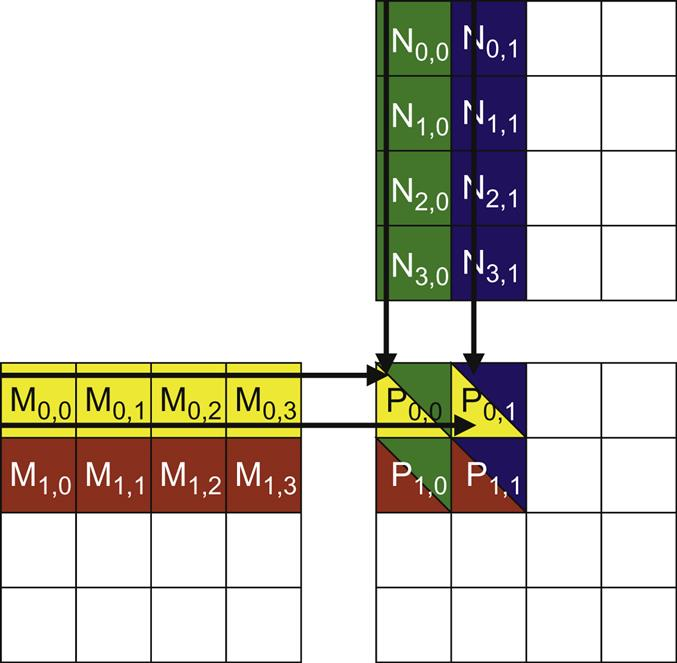
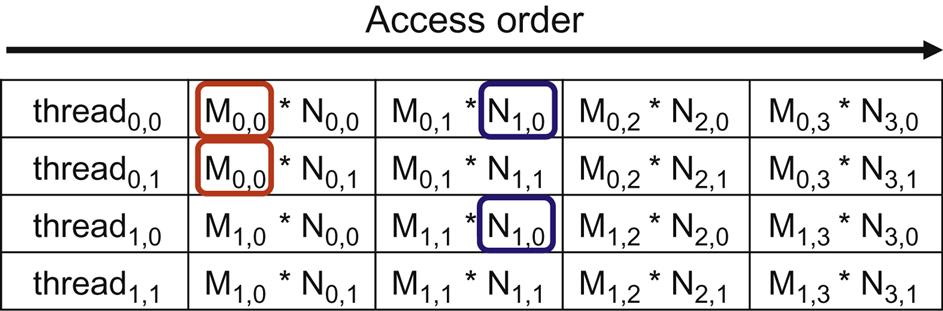
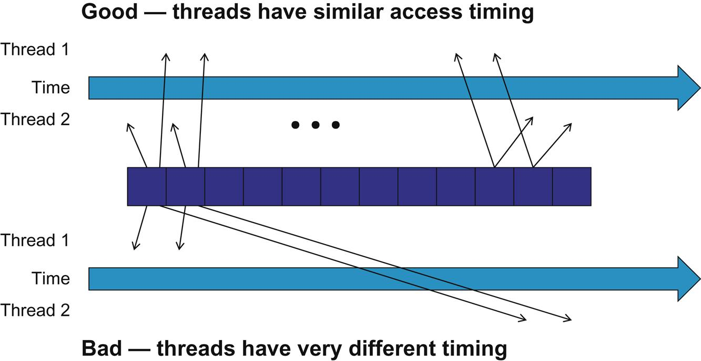
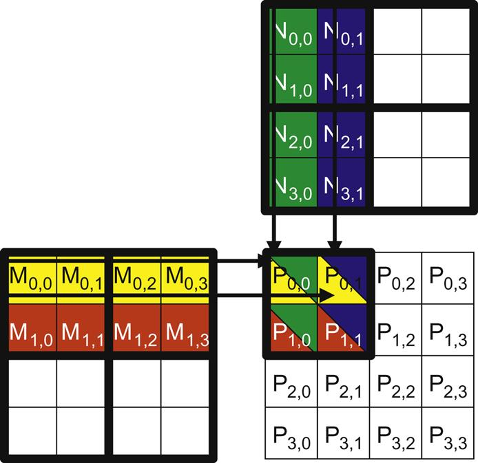
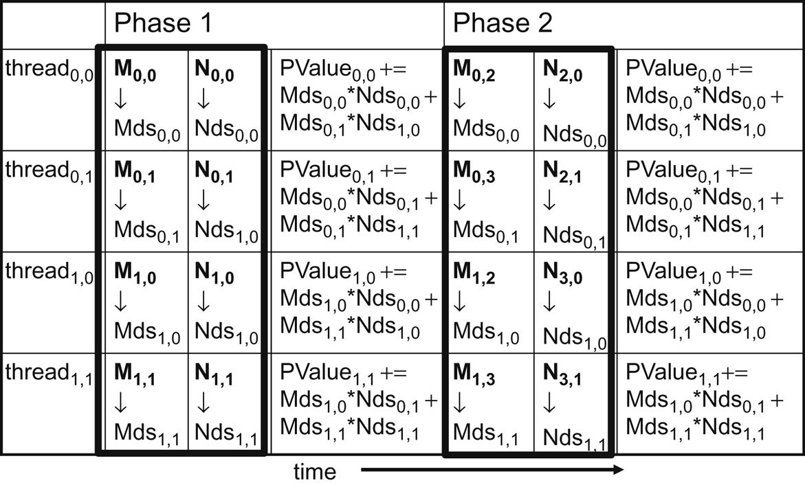

There's an intrinsic tradeoff in the use of device memories in CUDA: the **global memory** is large but slow, whereas the **shared memory** is small but fast.

(To recap on the memory hierarchy: [The CUDA Parallel Programming Model - 1. Concepts](/cuda1), on how to specify memories for variables: [CUDA Programming - 2. CUDA Variable Type Qualifiers](/cudaProg2-Variables).)

A common strategy to reduce memory traffic is to partition the **data** into subsets called **tiles** so that **each tile fits into the shared memory**. An important criterion is that kernel computation on these tiles can be performed independently of each other. Note that **not** all data structures can be partitioned into tiles given an arbitrary kernel function.

The term “tile” draws on the analogy that a large wall (i.e., the global memory data) can be covered by tiles (i.e., subsets that each can fit into the shared memory).

To illustrate the concept of tiling, we use the example from [CUDA Programming - 1. Matrix Multiplication](/cudaProg1-matrixmult), assumes that we use four 2×2 blocks to compute the P matrix. The picture below highlights the computation performed by the four threads of block(0,0):

Another picture (below) is used to show the global memory accesses performed by block(0, 0). Among the four threads highlighted, a significant **overlap** occurs in the M and N elements they access.

If thread(0, 0) and thread(0, 1) can be made to collaborate so that these M elements are only loaded from the global memory once, the total number of accesses to the global memory can be reduced by half.

(The potential reduction in global memory traffic in the matrix multiplication example is proportional to the dimension of the blocks used. With Width ×Width blocks, the potential reduction of global memory traffic would be Width. Thus, if we use 16 ×16 blocks, the global memory traffic can be potentially reduced to 1/16 through collaboration between threads)

## Tiled Algorithms

### threads and their DRAM accesses

Tiled algorithms are highly similar to carpooling arrangements. We can consider **threads** accessing data values as commuters and **DRAM access** requests as vehicles.

When the rate of DRAM requests exceeds the provisioned access **bandwidth** of the DRAM system, traffic congestion arises and the arithmetic units become idle.

If multiple threads access data from the same DRAM location, they can potentially form a “carpool” and **combine their accesses into one DRAM request**.

However, this process requires a **similar execution schedule** for the threads so that their data accesses can be combined.

This scenario is shown in the picture below:

- the cells at the center represent DRAM locations

- an arrow from a DRAM location pointing to a thread represents an access by the thread to that location at the time marked by the head of the arrow

- the top portion shows two threads that access the same data elements with similar timing

- the bottom half shows two threads that access their common data at varying times i.e., the accesses by Thread 2 lag significantly behind their corresponding accesses by Thread 1.

the reason the bottom is an undesirable arrangement is that data elements that are brought back from the DRAM need to be stored in the on-chip memory for an extended time, waiting to be consumed by Thread 2. A large number of data elements will need to be stored, resulting in an excessive on-chip memory requirement.

### tiling as a parallel algorithm

In the context of parallel computing, tiling is a program transformation technique that **localizes the memory locations accessed among threads and the timing of their accesses**.

It divides the long access sequences of each thread into **phases** and uses **barrier synchronization** to keep the timing of accesses to each section at close intervals.

This technique controls the amount of on-chip memory required by localizing the accesses both in time and in space. In terms of our carpool analogy, we force the threads that form the “carpool” group to follow approximately the same execution timing.

### example

A tiled matrix multiplication algorithm is shown in the picture below:

The basic idea is _for the threads to collaboratively load subsets of the M and N elements into the shared memory before they individually use these elements in their dot product calculation_. The size of the shared memory is quite small, and the capacity of the shared memory should not be exceeded when these M and N elements are loaded into the shared memory. This condition can be satisfied by dividing the M and N matrices into smaller tiles so that they can fit into the shared memory. In the simplest form, the tile dimensions equal those of the block.

In the picture above, we divide M and N into 2 ×2 tiles. The dot product calculations performed by each thread are now divided into phases.

In each phase, all threads in a block collaborate to load a tile of M and a tile of N into the shared memory. This collaboration can be accomplished by having every thread in a block to load **one M element** and **one N element** into the shared memory, as illustrated in the picture below:

Each row in this picture shows the execution activities of a thread. Only the activities of threads in block(0,0) are shown here but all of the other blocks have the same behavior.

The shared memory array for the M elements is called `Mds`, and that for the N elements is called `Nds`.

At the beginning of Phase 1, the four threads of block(0,0) collaboratively load a tile of M into a shared memory:

- `thread0,0` loads `M0,0` into `Mds0,0`
- `thread0,1` loads `M0,1` into `Mds0,1`
- `thread1,0` loads `M1,0` into `Mds1,0`
- `thread1,1` loads `M1,1` into `Mds1,1`

After the two tiles of M and N are loaded into the shared memory, these elements are used in the calculation of the dot product.

Each value in the shared memory is used twice. i.e. the `M1,1` value loaded by `thread1,1` into `Mds1,1` is used twice:

- the first time by `thread1,0`
- the second time by `thread1,1`

By loading each global memory value into the shared memory so that it can be used multiple times, we reduce the number of accesses to the global memory; in this case, we reduce it by half. The reader should verify that the reduction occurs by a factor of N if the tiles are N×N elements.

Note that the calculation of each dot product is now performed in two phases. In each phase, the products of two pairs of the input matrix elements are accumulated into the `Pvalue` variable. `Pvalue` is an **automatic variable**; a **private version is generated for each thread**. We added subscripts to indicate different instances of the Pvalue variable created for each thread.

In general, if an input matrix is of the dimension Width and the tile size is referred to as TILE_WIDTH, the dot product would be performed in Width/TILE_WIDTH phases. The creation of these phases is key to the reduction of accesses to the global memory. With each phase focusing on a small subset of the input matrix values, the threads can collaboratively load the subset into the shared memory and use the values in the shared memory to satisfy their overlapping input demands in the phase.

Note also that `Mds` and `Nds` are reused to hold the input values. In each phase, the same Mds and Nds are used to hold the subset of M and N elements in the phase, thereby allowing a much smaller shared memory to serve most of the accesses to global memory. This is due to the fact that each phase focuses on a small subset of the input matrix elements. Such focused access behavior is called **locality**. When an algorithm exhibits locality, an opportunity arises to use small, high-speed memories in order to serve most of the accesses and remove these accesses from the global memory. Locality is as important for achieving high-performance in multi-core CPUs as in many-thread GPUs. The concept of locality is also talked about in [The CUDA Parallel Programming Model - 5. Memory Coalescing](/cuda5-coalesce)
