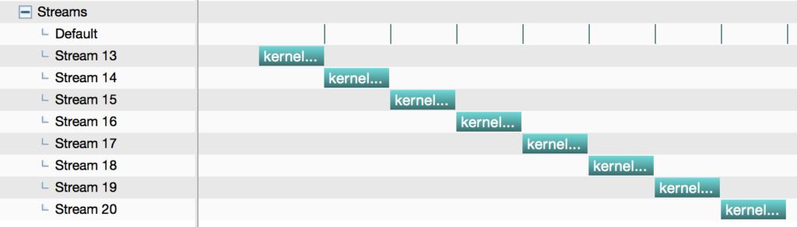

In the previous posts, we have sometimes assumed that only one kernel is launched at a time. But this is not all that kernels can do. They can be launched **sequentially** or **in parallel**. It's just that if multiple kernels are launched in parallel, CUDA streams must be used.

## Motivation

**Heterogeneous computing** is about efficiently using all processors in the system, including CPUs and GPUs. To do this, applications must **execute functions concurrently** on multiple processors.

CUDA Applications manage concurrency by executing **asynchronous** commands in streams.

- Each stream is a sequences of commands that execute **in order**.

- Different streams may execute their commands concurrently or **out of order** with respect to each other.

## What is a Stream?

In CUDA, stream refers to **a single operation sequence** on a GPU device.

- Every CUDA kernel is invoked on an independent stream

- If only one kernel is invoked, the default stream, stream0, is used

- When you execute asynchronous CUDA commands without specifying a stream, the runtime uses the default stream

- If n kernels are invoked in parallel, n streams need to be used

```c
  kernel<<< blocks, threads, bytes >>>();    // default stream
  kernel<<< blocks, threads, bytes, 0 >>>(); // also default stream
```

In CUDA, we can run multiple kernels on different streams concurrently. Typically, we can improve performance by increasing number of concurrent streams by setting a higher degree of parallelism.

## Asynchronous Commands

### side note on blocking & non-blocking

A function is said to be blocking if it calls an operating system function that waits for an event to occur or a time period to elapse.

Whilst a blocking call is waiting, the operating system can often remove that thread from the scheduler, so it takes no CPU time until the event has occurred or the time has elapsed.

Once the event has occurred then the thread is placed back in the scheduler and can run when allocated a time slice. A thread that is running a blocking call is said to be blocked.

Non-blocking threads meaning threads competing for a shared resource do not have their execution indefinitely postponed by mutual exclusion.

### asynchronous commands, non-blocking

Asynchronous commands return control to the calling host thread before the device has finished the requested task (they are **non-blocking**). These commands are:

- Kernel launches
- Memory copies between two addresses to the same device memory
- Memory copies from host to device of a memory block of 64 KB or less
- Memory copies performed by functions with the Async suffix
- Memory set function calls

CUDA 7 introduced the per-thread default stream, that has two effects:

1. it gives each host thread its own default stream. This means that commands issued to the default stream by different host threads can run concurrently.
1. these default streams are regular streams. This means that commands in the default stream may run concurrently with commands in non-default streams.

To learn more about how to invoke these options in `nvcc`, check out the _CUDA C Programming Guide_.

## Between Streams

The concurrent streams are **independent**, which means that streams neither communicate nor have any inter-stream dependency.

However, different streams may have different execution times (**asynchronous**), and we cannot guarantee that all streams will complete at the same time. To ensure all streams are synchronized, use a synchronization barrier.

## Synchronize Streams

There are two types of stream synchronization in CUDA. A programmer can place the synchronization barrier explicitly, to synchronize tasks such as memory operations. Some functions are implicitly synchronized, which means one or all streams must complete before proceeding to the next section.

### explicit synchronization

Invoking multiple concurrent kernels requires slightly more programming than invoking one kernel at a time:

- Kernels need to be assigned to different streams and invoked asynchronously
- Kernel launch and memory transfer functions need to be assigned to the same stream
- pinned memory must be used
- Asynchronous memory transfer API functions must be used
- the synchronization barrier cudaStreamSynchronize() must be used to ensure all tasks are synchronized

### implicit synchronization

The following operations are implicitly synchronized; therefore, no barrier is needed:

- page-locked memory allocation
  - cudaMallocHost
  - cudaHostAlloc
- device memory allocation
  - cudaMalloc
- Non-asynchronized memory operation
  - cudaMemcpy
- Memory configuration
  - cudaDeviceSetCacheConfig

## Visualize a Multi-Stream Example

### a multi-stream example

```c
const int N = 1 << 20;

__global__ void kernel(float *x, int n)
{
    int tid = threadIdx.x + blockIdx.x * blockDim.x;
    for (int i = tid; i < n; i += blockDim.x * gridDim.x) {
        x[i] = sqrt(pow(3.14159,i));
    }
}

int main()
{
    const int num_streams = 8;

    cudaStream_t streams[num_streams];
    float *data[num_streams];

    for (int i = 0; i < num_streams; i++) {
        cudaStreamCreate(&streams[i]);

        cudaMalloc(&data[i], N * sizeof(float));

        // launch one worker kernel per stream
        kernel<<<1, 64, 0, streams[i]>>>(data[i], N);

        // launch a dummy kernel on the default stream
        kernel<<<1, 1>>>(0, 0);
    }

    cudaDeviceReset();

    return 0;
}
```

### no concurrency

If the above code is run without concurrency:



### with concurrency

If the above code is run with full-concurrency (can be achieved by utilizing `nvcc`'s `--default-stream per-thread` option)


## Visualize a Multi-Thread Example

The following example creates eight POSIX threads, and each thread calls the kernel on the default stream and then synchronizes the default stream.

```c
#include <pthread.h>
#include <stdio.h>

const int N = 1 << 20;

__global__ void kernel(float *x, int n)
{
    int tid = threadIdx.x + blockIdx.x * blockDim.x;
    for (int i = tid; i < n; i += blockDim.x * gridDim.x) {
        x[i] = sqrt(pow(3.14159,i));
    }
}

void *launch_kernel(void *dummy)
{
    float *data;
    cudaMalloc(&data, N * sizeof(float));

    kernel<<<1, 64>>>(data, N);

    cudaStreamSynchronize(0);

    return NULL;
}

int main()
{
    const int num_threads = 8;

    pthread_t threads[num_threads];

    for (int i = 0; i < num_threads; i++) {
        if (pthread_create(&threads[i], NULL, launch_kernel, 0)) {
            fprintf(stderr, "Error creating threadn");
            return 1;
        }
    }

    for (int i = 0; i < num_threads; i++) {
        if(pthread_join(threads[i], NULL)) {
            fprintf(stderr, "Error joining threadn");
            return 2;
        }
    }

    cudaDeviceReset();

    return 0;
}
```

### no concurrency

All threads are serialized:


### with concurrency

If we compile the code with the same `--default-stream per-thread` option, each thread creates a new stream automatically and they do not synchronize.


