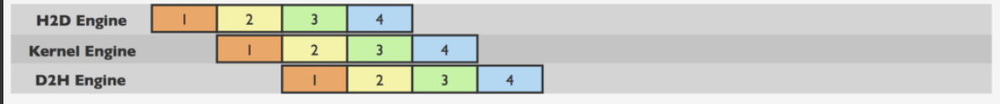
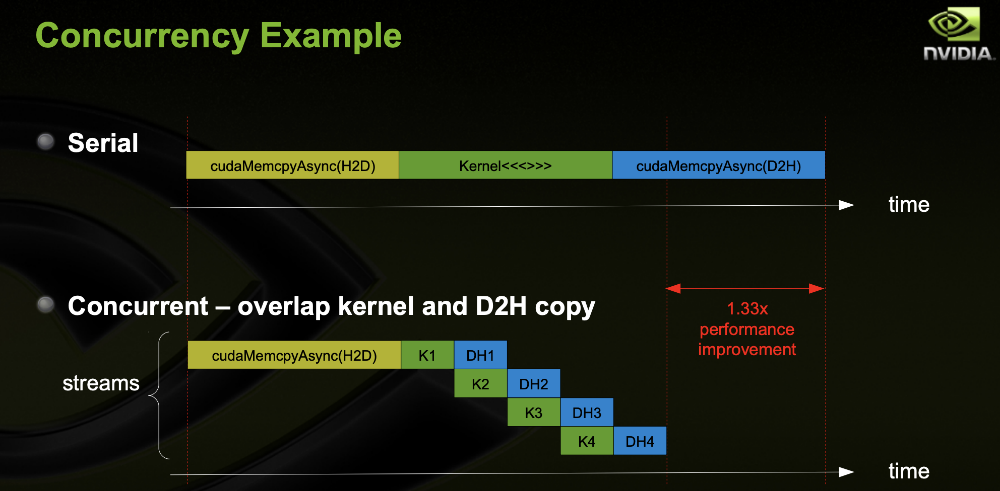
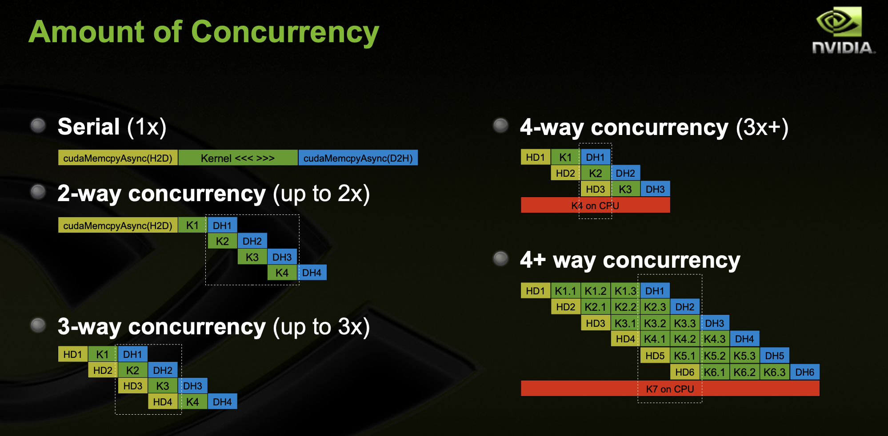

In the last post, we saw how full concurrency can be achieved amongst streams. Here I'd like to talk about how CUDA operations from different streams may also be **interleaved**, which is another programming model often used to effect concurrency.

### Review CUDA Streams

A stream in CUDA is a sequence of operations that execute on the device in the order in which they are issued by the host code.

While operations within a stream are guaranteed to execute in the prescribed order, operations in different streams can be **interleaved** and, when possible, they can even run **concurrently**.

### Review CUDA Asynchronous Commands

Being asynchronous means that CUDA can perform these operations simultaneously

- CUDA Kernel <<<>>>

- cudaMemcpyAsync (HostToDevice)

- cudaMemcpyAsync (DeviceToHost)

- Operations on the CPU

### 🌟 What Can Happen Simultaneously 🌟

- computation on the device

  - lots of CUDA kernels on GPU

- data transfers between the host and device

  - `cudaMemcpyAsyncs` both HostToDevice and DeviceToHost

- computation on the CPU

## No Concurrency

The two examples below are completely synchronous:

### example 1

```c
cudaMemcpy(d_a, a, numBytes, cudaMemcpyHostToDevice);
increment<<<1,N>>>(d_a)
cudaMemcpy(a, d_a, numBytes, cudaMemcpyDeviceToHost);
```

- From the perspective of the **device**:

  - all three operations are issued to the same (default) stream, thus will execute in the order that they were issued

- From the perspective of the **host**:
  - the implicit data transfers are blocking or synchronous transfers
  - the kernel launch is asynchronous
  - 😳**Since the host-to-device data transfer on the first line is synchronous, the CPU thread will not reach the kernel call on the second line until the host-to-device transfer is complete**. Once the kernel is issued, the CPU thread moves to the third line, but the transfer on that line cannot begin due to the device-side order of execution.

### example 2

```c
cudaMemcpy ( dev1, host1, size, H2D ) ;
kernel2 <<< grid, block, 0 >>> ( …, dev2, … ) ;
kernel3 <<< grid, block, 0 >>> ( …, dev3, … ) ;
cudaMemcpy ( host4, dev4, size, D2H ) ;
```

All CUDA operations in the default stream are synchronous.

## Overlap Device and Host Computation

The asynchronous behavior of kernel launches from the host’s perspective makes **overlapping device and host computation** very simple.

In the modified code below, an independent CPU computation is added:

```c
cudaMemcpy(d_a, a, numBytes, cudaMemcpyHostToDevice);
increment<<<1,N>>>(d_a)
myCpuFunction(b)
cudaMemcpy(a, d_a, numBytes, cudaMemcpyDeviceToHost);
```

As soon as the `increment()` kernel is launched on the device the CPU thread executes myCpuFunction(), **overlapping its execution on the CPU with the kernel execution on the GPU**.

Whether the host function or device kernel completes first doesn’t affect the subsequent device-to-host transfer, which will begin only after the kernel completes.

From the perspective of the device, nothing has changed from the previous example; the device is completely unaware of myCpuFunction().

#### special note

GPU kernels are asynchronous with host by default.

## Requirements For Concurrency

- The kernel execution and the data transfer to be overlapped must **both occur in different, non-default streams**.

- Must `cudaMemcpyAsync` with host from 'pinned' memory

  - Page-locked memory
  - Allocated using cudaMallocHost() or cudaHostAlloc()

- Sufficient resources must be available
  - cudaMemcpyAsyncs in different directions
  - Device resources (SMEM, registers, blocks, etc.)
  - The device must be capable of “concurrent copy and execution”

## Asynchronous with Streams

```c
cudaStream_t stream1, stream2, stream3, stream4 ;
cudaStreamCreate ( &stream1) ;
...
cudaMalloc ( &dev1, size ) ;
cudaMallocHost ( &host1, size ) ; // pinned memory required on host
…
cudaMemcpyAsync ( dev1, host1, size, H2D, stream1 ) ;
kernel2 <<< grid, block, 0, stream2 >>> ( …, dev2, … ) ;
kernel3 <<< grid, block, 0, stream3 >>> ( …, dev3, … ) ;
cudaMemcpyAsync ( host4, dev4, size, D2H, stream4 ) ;
some_CPU_method ();
...
```

The use of different, non-default streams make the code above fully asynchronous/concurrent. The four streams are potentially overlapped.

#### special note

Note that: **data** used by concurrent operations should be **independent**.

## Overlap Computation and Data Transfers

```c
for (int i = 0; i < nStreams; ++i) {
  int offset = i * streamSize;
  cudaMemcpyAsync(&d_a[offset], &a[offset], streamBytes, cudaMemcpyHostToDevice, stream[i]);
  kernel<<<streamSize/blockSize, blockSize, 0, stream[i]>>>(d_a, offset);
  cudaMemcpyAsync(&a[offset], &d_a[offset], streamBytes, cudaMemcpyDeviceToHost, stream[i]);
}
```

In the modified code, we break up the array of size N into chunks of streamSize elements. Since the kernel operates independently on all elements, each of the chunks can be processed independently.



The number of (non-default) streams used is `nStreams=N/streamSize`. In the picture above there are 4 streams.

## Synchronization

### Explicit

- Synchronize everything

  - cudaDeviceSynchronize ()
  - Blocks host until all issued CUDA calls are complete

- Synchronize w.r.t. a specific stream

  - cudaStreamSynchronize ( streamid )
  - Blocks host until all CUDA calls in streamid are complete

- Synchronize using Events
  - Create specific 'Events', within streams, to use for synchronization
  - cudaEventRecord ( event, streamid )
  - cudaEventSynchronize ( event )
  - cudaStreamWaitEvent ( stream, event )
  - cudaEventQuery ( event )

#### example

```c
{
 cudaEvent_t event;
 cudaEventCreate (&event); // create event

 cudaMemcpyAsync ( d_in, in, size, H2D, stream1 ); // 1) H2D copy of new input
 cudaEventRecord (event, stream1); // record event

 cudaMemcpyAsync ( out, d_out, size, D2H, stream2 ); // 2) D2H copy of previous result
 cudaStreamWaitEvent ( stream2, event ); // wait for event in stream1

 kernel <<< , , , stream2 >>> ( d_in, d_out ); // 3) must wait for 1 and 2
 asynchronousCPUmethod ( … ) // Async GPU method
}
```

### Implicit

These operations implicitly synchronize all other CUDA operations

- Page-locked memory allocation

  - cudaMallocHost
  - cudaHostAlloc

- Device memory allocation

  - cudaMalloc

- Non-Async version of memory operations
  - cudaMemcpy\* (no Async suffix)
  - cudaMemset\* (no Async suffix)
- Change to L1/shared memory configuration
  - cudaDeviceSetCacheConfig

## Measure Performance Gain





To read more about concurrency and streams:
https://developer.download.nvidia.com/CUDA/training/StreamsAndConcurrencyWebinar.pdf
https://devblogs.nvidia.com/how-overlap-data-transfers-cuda-cc/
