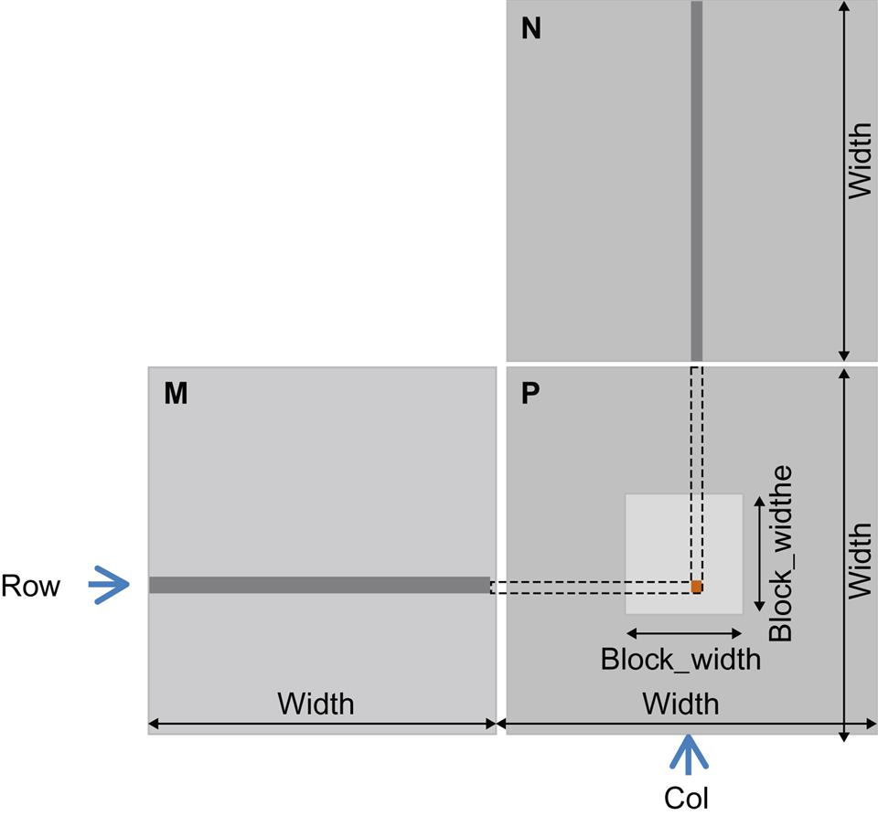
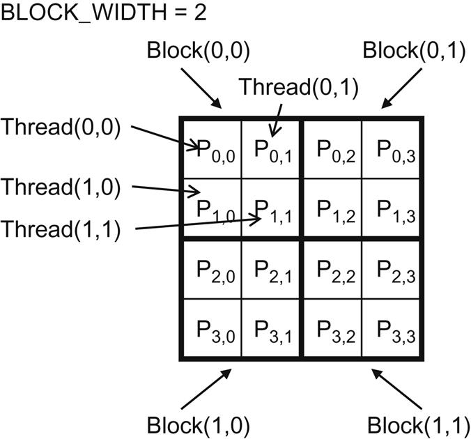

## Notation

- Matrix `M`
- Matrix `N`
- Output Matrix `P`
- row counter: `i`
- column counter: `j`
- `P(Row, Col)` is the element at `Row-th` position in the vertical direction and `Col-th` position in the horizontal direction

As shown in the picture below, `P(Row,Col)` (the small square in P) is the inner product of:

- the `Row-th` row of M
- the `Col-th` column of N



## Indexing

The row index for the P element is:

`Row = blockIdx.y * blockDim.y + threadIdx.y`

The column index for the P element is:

`Col = blockIdx.x * blockDim.x + threadIdx.x`

With this one-to-one mapping, the `Row` and `Col` thread indexes are also the row and column indexes for output array

## Simple Kernel Using One Thread

Note that the `Width` used below is the `Width` in the picture above.

```c
__global__ void MatrixMulKernel (float* M, float* N, float* P, int Width){
    // calculate the row index of the P element and M
    int Row = blockIdx.y * blockDim.y + threadIdx.y;
    // calculate the col index of the P element and N
    int Col = blockIdx.x * blockDim.x + threadIdx.x;

    if((Row < Width) && (Col < Width>)){
        float Pvalue = 0;
        //each thread computes one element of the block sub-matrix
        for(int k = 0; k < Width; k++) {
            Pvalue += M[Row*Width + k] * N[k*Width + Col];
        }
        P[Row * Width + Col] = Pvalue;
    }
}
```

#### memory access of the for loop

In every iteration of the loop, **two global memory accesses** are performed for one floating-point multiplication and one floating-point addition.

##### memory accesses

- One global memory access fetches an M element
- the other fetches an N element

##### computation performed

- One floating-point operation multiplies the M and N elements fetched
- the other accumulates the product into Pvalue

##### compute-to-global-memory-access ratio

The **compute-to-global-memory-access ratio** of the loop is 1.0.

This ratio will likely result in less than 2% utilization of the peak execution speed of the modern GPUs.

We need to increase the ratio by at least an order of magnitude for the computation throughput of modern devices to achieve good utilization.

## Execution of the Matrix Multiplication Kernel Within A Block

#### setting

- size of `P` is 4×4

- `BLOCK_WIDTH = 2`

#### map threads to P

With:

- blocks that are 2×2 arrays of threads
- each thread calculating one P element



The P matrix is now divided into four tiles, and each block calculates one tile.

- In the example, `thread(0,0)` of `block(0,0)` calculates `P(0,0)`
- `thread(0,0)` of `block(1,0)` calculates `P(2,0)`

#### actions of one thread block

The picture below illustrates the multiplication operations in each thread block.

Threads in block (0,0) produce four dot products.


#### the execution of the for-loop

Use `thread(0,0)` in `block(0,0)` as an example.

- During the 0th iteration (k=0):
  - `Row * Width + k = 0*4+0 = 0`
  - `k * Width + Col= 0*4+0 = 0`
  - Therefore, we are accessing `M[0]` and `N[0]`, which are the 1D equivalent of `M(0,0)` and `N(0,0)`
- During the 1st iteration (k=1):
  - `Row * Width + k = 0*4+1 = 1`
  - `k * Width + Col = 1*4+0 = 4`
  - We are accessing `M[1]` and `N[4]`, which are the 1D equivalent of `M(0,1)` and `N(1,0)`

## Tiled Kernel

To see how to use tiling (corner turning) technique to overcome the fact that row-wise access of matrix M cannot be coalesced, see _Corner Turning_ section in [The CUDA Parallel Programming Model - 5.Memory Coalescing](./cuda5-coalesce).
