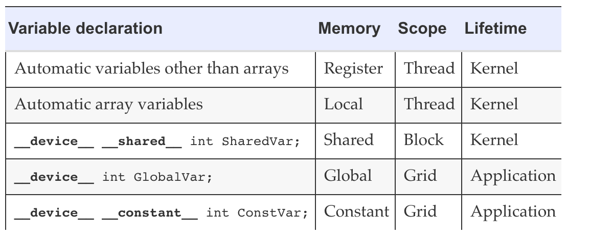

## CUDA Variable Type Qualifiers

#### lifetime == kernel?

- If the lifetime of a variable is within a kernel execution, it must be declared **within the kernel function body** and will be available for use only **by the kernel code**

- If the kernel is invoked several times, the value of the variable is not maintained across these invocations. Each invocation must initialize the variable in order to use them

#### lifetime == application?

- if the lifetime of a variable continues throughout the entire application, it must be declared **outside of any function body**

- The contents of these variables are maintained throughout the execution of the application and available to all kernels

#### scalar variables

- as shown in the picture above, all automatic scalar variables declared in **kernel and device** functions are placed into registers.

- The **scopes** of these automatic variables are **within individual threads**.

  - When a kernel function declares an automatic variable, a private copy of that variable is generated for every thread that executes the kernel function.

  - When a thread terminates, all its automatic variables also cease to exist. Note that accessing these variables is extremely fast and parallel; however, one must be careful _not to exceed the limited capacity_ of the register storage in hardware implementations.

  - Using a large number of registers can negatively affect the number of active threads assigned to each SM.

#### array variables

Automatic array variables are not stored in registers.

- They are stored into the global memory
- may incur long access delays and potential access congestions

Similar to automatic scalar variables, the scope of these arrays is limited to individual threads; i.e., a private version of each automatic array is created for and used by every thread.

Once a thread terminates its execution, the contents of its automatic array variables also cease to exist.

#### \_**\_shared\_\_**

Declares a shared variable in CUDA.

- An optional “**device**” in front of “**shared**” keyword may also be added in the declaration to achieve the **same** effect.

- Such declaration typically resides within a kernel function or a device function.

- Shared variables reside in the shared memory.

- The scope of a shared variable is within a thread block; i.e., all threads in a block see the same version of a shared variable.

- A private version of the shared variable is created for and used by each thread block during kernel execution.

- The lifetime of a shared variable is within the duration of the kernel. When a kernel terminates its execution, the contents of its shared variables cease to exist.

- Accessing shared variables from the shared memory is extremely fast and highly parallel. CUDA programmers often use shared variables to hold the portion of global memory data that are heavily used in a kernel execution phase.

#### \_**\_constant\_\_**

Declares a constant variable in CUDA.

- An optional “**device**” keyword may also be added in front of “**constant**” to achieve the same effect.

- Declaration of constant variables must be **outside any function body**.

- The scope of a constant variable spans all grids, meaning that **all threads in all grids see the same version of a constant variable**.

- The lifetime of a constant variable is the entire application execution.

- Constant variables are often used for variables that **provide input values to kernel functions**.

- Constant variables are **stored in the global memory** but are **cached** for efficient access. With appropriate access patterns, accessing constant memory is extremely fast and parallel.

#### \_**\_device\_\_**

A variable whose declaration is preceded **only** by the keyword “**device**” is a global variable and will be placed in the **global memory**.

- Accesses to a global variable are slow.

- One important advantage of global variables is that they are visible to all threads of all kernels.

- Their contents also persist throughout the entire execution.

- Thus, global variables can be used as a means for **threads to collaborate across blocks**.

- However, the only easy way to synchronize between threads from different thread blocks or to ensure data consistency across threads when accessing global memory is by **terminating the current kernel execution**. Therefore, global variables are often used to pass information from one kernel invocation to another kernel invocation.

#### pointers

In CUDA, pointers are used to point to data objects in the **global memory**.

Pointer usage arises in kernel and device functions in two ways: ( 1. if an object is allocated by a host function, the pointer to the object is initialized by cudaMalloc and can be passed to the kernel function as a parameter 2. the address of a variable declared in the global memory is assigned to a pointer variable. To illustrate, the statement `{float* ptr=&GlobalVar;}` in a kernel function assigns the address of GlobalVar into an automatic pointer variable ptr.
