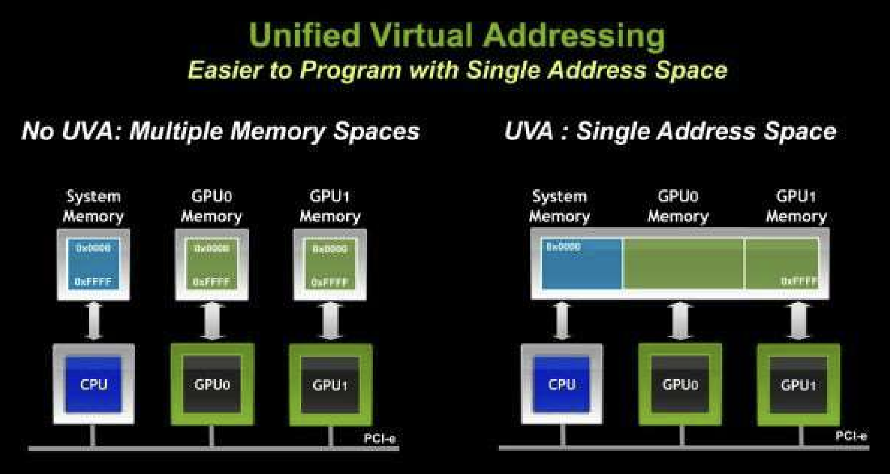
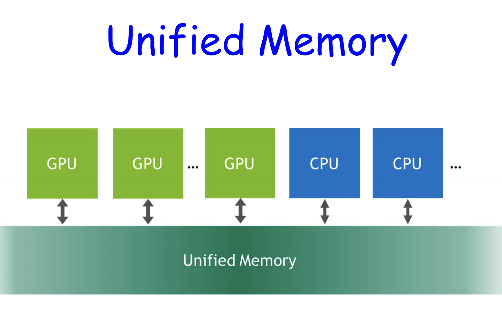

## Unified Virtual Address Space (UVA)

From CUDA 4.0 and on, UVA has been an important feature. It

- puts all CUDA execution, host and GPUs, in the same address space
- Requires Fermi-class GPU and above
- Requires 64-bit application
- Call `cudaGetDeviceProperties()` for all participating devices and check `unifiedAddressing` flag



### easier memory access with UVA

Zero-copy

- UVA provides a **single virtual memory address space** for all memory in the system, and enables pointers to be accessed from GPU code no matter where in the system they reside.

- Pointers returned by cudaHostAlloc() can be used directly from within kernels running on UVA enabled devices
  – Data cache in L2 of target device.

### easier memory copy with UVA

#### between host and multiple devices

```c
cudaMemcpy(gpu0_buf, host_buf, buf_size, cudaMemcpyDefault)
cudaMemcpy(gpu1_buf, host_buf, buf_size, cudaMemcpyDefault)
cudaMemcpy(host_buf, gpu0_buf, buf_size, cudaMemcpyDefault)
cudaMemcpy(host_buf, gpu1_buf, buf_size, cudaMemcpyDefault)
```

#### between two devices:

```c
cudaMemcpy(gpu0_buf, gpu1_buf, buf_size, cudaMemcpyDefault)
```

cudaMemcpy() knows that our buffers are on different devices.

## Unified Memory

Available for CUDA 6.0 and up.



Creates a pool of managed memory that is shared between the CPU and GPU.

- Managed memory is accessible to CPU and GPU with single pointers.
- Under the hood: data (granularity = pages) automatically migrates from CPU to GPU and among GPUs.
  - Pascal GPU architecture is the first with hardware support for virtual memory page faulting and migration.

### usage

```c
cudaError_t cudaMallocManaged(void** ptr, size_t size)
```

ptr can be used by any GPU and CPU in the system.

#### Pascal GPU:

- Pages may not be created until they are accessed by the GPU or the CPU.
- Pages automatically migrate to the device (or host) that access them.

#### Pre-PASCAL (i.e. Kepler and Maxwell)

- With single GPU, data will be allocated on the GPU device that is active when the call is made.
- On multi-GPU systems, if some of the GPUs have peer-to-peer access disabled, the memory will be allocated so it is initially resident on the CPU.

#### example

```c
int main() {
    int *ret;

    cudaMallocManaged(&ret, 1000 * sizeof(int));

    AplusB<<< 1, 1000 >>>(ret, 10, 100);
    cudaDeviceSynchronize();

    for(int i=0; i<1000; i++)
        printf("%d: A+B = %d\n", i, ret[i]);

    cudaFree(ret);
    return 0;
}
```

### difference between UVA and unified memory

- Unified memory depends on UVA.
- UVA does NOT move data automatically between CPU and GPU.
- Unified memory gives higher performance than UVA.

### pros and cons of unified memory

#### advantages

- Ease of programming
- Data is migrated on demand
  – offer the performance of local data on the GPU
  – while providing the ease of use of globally shared data
- Very efficient with complex data structures (e.g. linked lists, structures with pointers, … ).

#### disadvantage

Carefully tuned CUDA program that uses streams to efficiently overlap execution with data transfers may perform better than a CUDA program that only uses Unified Memory.
