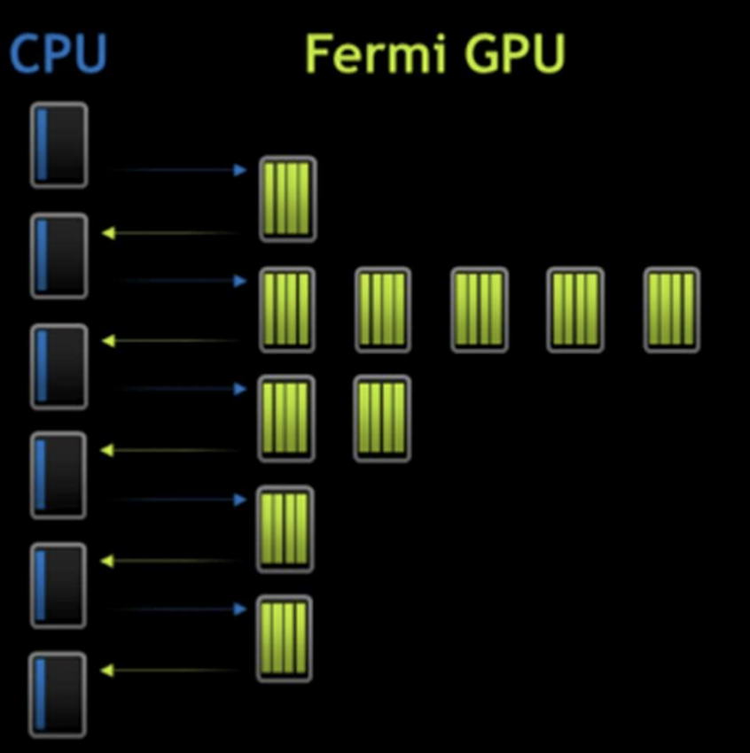
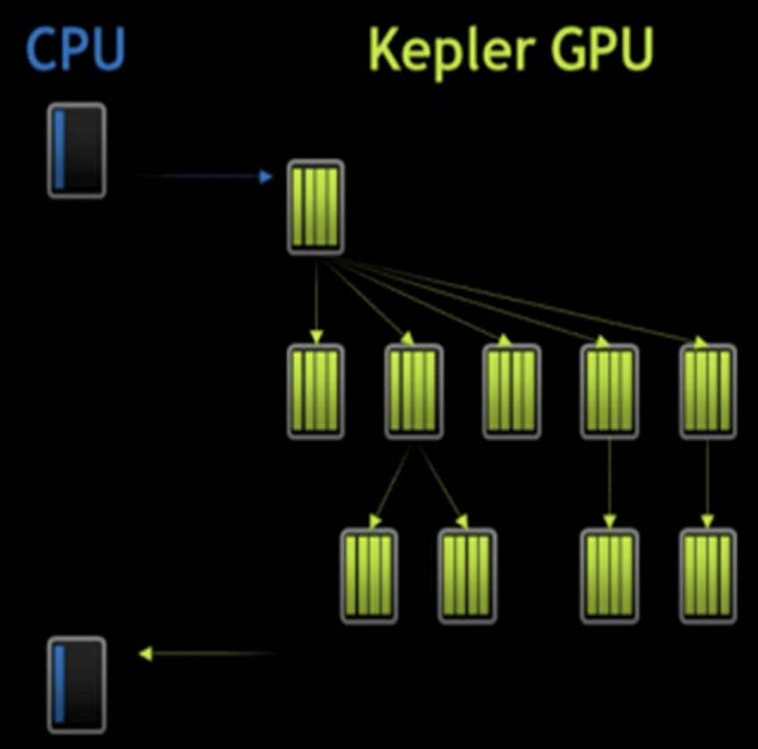

Have you wondered if it's possible to launch nested kernels (i.e. a kernel calls another kernel) in CUDA? Well, this is where dynamic parallelism comes into play.

## No Dynamic Parallelism

Without dynamic parallelism, GPU is unable to create more work on itself dynamically depending on the data. Consequently data travels back and forth between the CPU and GPU many times. This was the case in older generations e.g. Fermi, see picture below:



## With Dynamic Parallelism

With dynamic parallelism, however:

- GPU can generate work on itself without involvement of CPU
  - reduce the trips to CPU
- Permits Dynamic Runtime decisions
  - More freedom where data generated by the kernel decides how to partition the data for lower-level of the hierarchy.
- Kernels can start new kernels
  - **recursion**!!
- Streams can spawn new streams



### code example

```c
__global__ ChildKernel(void* data){
    // operate on data
}

__global__ ParentKernel(void* data){
    if (threadIdx.x == 0) {
        ChildKernel<<<1, 32>>>(data);
        cudaThreadSynchronize();
    }
    syncthreads();
    //operate on data
}

// in host code
ParentKernel<<<8, 32>>>(data);
```

## Some Special Notes

### asynchronous operation

As we have talked about before in [The CUDA Parallel Programming Model - 8. Concurrency by Stream](/cuda8-Stream), device kernel launch is asynchronous.

- Successful execution of a kernel launch means that the kernel is queued

  - it may begin executing immediately
  - or it may execute later when resources become available.

- Note that every thread that encounters a kernel launch executes it. So be careful!

- Child grids always complete before the parent grids that launch them, even if there is no explicit synchronization.

### sequential execution of thread grids

By default, grids launched within a thread block are executed sequentially.

- This happens even if grids are launched by different threads within the block.

- To deal with this drawback, use streams

- streams created on the host cannot be used on the device.

- Streams created in a block can be used by all threads in that block.

### parent-child dependency

If the parent kernel needs results computed by the child kernel to do its own work, it must ensure that the **child grid** has finished execution before continuing. This is done by:

- explicitly synchronizing using cudaDeviceSynchronize(void).
  - This function waits for completion of all grids previously launched by the thread block from which it has been called.

```c
void threadBlockDeviceSynchronize(void){
    __syncthreads(); // ensure all launches have been executed
    if(threadIdx.x == 0)
        cudaDeviceSynchronize();
    __syncthreads();
}
```
