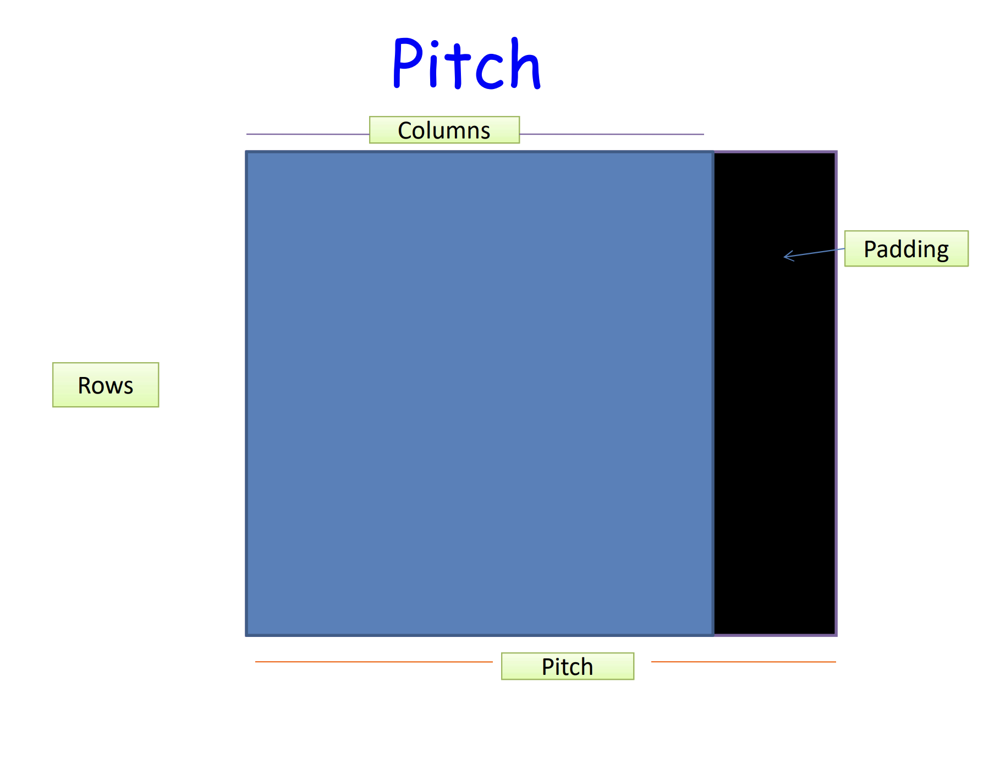

In the fifth post of the CUDA series ([The CUDA Parallel Programming Model - 5. Memory Coalescing](/cuda5-coalesce)), I put up a note on the effect of memory alignment on memory coalesce. Here I feel necessary to add a little bit more.

Memory access on the GPU works much better if the data items are aligned. Hence, allocating 2D or 3D arrays so that every row starts at a 64-byte or 128-byte boundary address will imporve performance. However, this is hard to do for programmers.

Don't worry, CUDA offers special memory operations that take care of alignment for us.

### what is pitch



Pitch is a good technique to speedup memory access

There are two drawbacks that you have to live with:

- Some wasted space
- A bit more complicated elements access

## cudaMallocPitch()

Memory allocation of 2D arrays using this function will pad every row if necessary. The function determines the best pitch and returns it to the program.

### signature

```c
cudaMallocPitch( void** devPtr,
                size_t* pitch,
                size_t widthInBytes,
                size_t height)
```

This allocates at least width (in bytes) X height array.

- The value returned in pitch is the width in bytes of the allocation.
- The above function determines the best pitch and returns it to the program.
- It is strongly recommended to use this function for allocating 2D (and 3D) arrays. (also take a look at cudaMalloc3D())

## cudaMemcpy2D()

This operation takes into account the pitch that was chosen by the memory allocation when copying memory.

### signature

```c
cudaError_t cudaMemcpy2D ( void * dst,
                        size_t dpitch,
                        const void * src,
                        size_t spitch,
                        size_t width,
                        size_t height,
                        enum cudaMemcpyKind kind )
```

- dst - Destination memory address
- dpitch - Pitch of destination memory
- src - Source memory address
- spitch - Pitch of source memory
- width - Width of matrix transfer (in bytes)
- height - Height of matrix transfer (rows)
- kind - Type of transfer

## example -- allocation

```c
int main(int argc, char * argv[]){
    float * A, *dA;
    size_t pitch;

    A = (float *)malloc(sizeof(float)*N*N);
    cudaMallocPitch(&dA, &pitch, sizeof(float)*N, N);

    //copy memory from unpadded array A of 760 by 760 dimensions
    //to more efficient dimensions on the device
    cudaMemcpy2D(dA,pitch,A,sizeof(float)*N,sizeof(float)*N,N,
    cudaMemcpyHostToDevice);
    …
}
```

## example -- accessing

```c
__global__ void MyKernel(float* devPtr, size_t pitch, int width, int height) {
    for (int r = 0; r < height; ++r) {
        float* row = (float*)((char*)devPtr + r * pitch);
        for (int c = 0; c < width; ++c) {
            float element = row[c];
        }
    }
}
```

## measure the waste of space

We have a 2D array with X rows and Y columns. For best performance, the array needs to be memory aligned on 64 byte boundary (as we have seen in pitch). Derive a formula to calculate percentage of wasted memory (the padding) in terms of X and Y, assuming that a single array element is one byte. Assume that the array is NOT already aligned (i.e. ignore the special case where no padding is necessary).

#### answer

Each row must be aligned at 64. Currently, each row takes `Y * 1 = Y` bytes.
We don't know how many 64-byte units a row is going to contain. But we can compute the amount of 'odd end' per row as `Y % 64`.
So, it needs `(64-(Y % 64))` extra bytes per row to be multiple of 64.

This makes total waste is `X(64-(Y%64))`

The percentage waste is thus: `(64-(Y%64))/Y`
