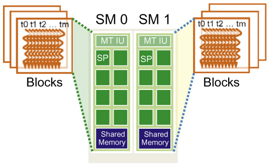

Motivated by a CUDA puzzle I tried to solve today, I'd like to talk more about resource assignment. 

## A Puzzle

### problem

Adding two big arrays element-wise.

### settings

* Suppose a GPU has 8 SMs
* Each SM has 32 SPs
* Warp size is 16, instead of 32
* kernel adds one element from each array together

### questions

Say if we were to compute everything sequentially, it takes time ```t``` to finish.

#### scenario 1

Assume that 256 threads are enough to keep all SPs in the SM busy all the time. What is the amount of time it'd take to perform the computation for **one block of 1024** threads? 

#### scenario 2

What if we use **two blocks** of **512 threads** each?

## CUDA Resource Assignment

In order to see how the two scenarios differ, I thougth it was necessary to take another look at how resources are assigned to blocks and warps.

### sequence of events

1. kernel launch

1. CUDA runtime generates the corresponding grid of threads.

1. threads are assigned to execution resources on a block-to-block basis.

### blocks and SMs

Multiple blocks can be assigned to each SM. But each device sets a limit on the number of blocks that can be assigned to each SM.

Say that a device allows 8 blocks to be assigned to each SM. In situations where there's a **shortage of one or more types of resources** needed for the simultaneous execution of 8 blocks, the CUDA runtime automatically reduces the number of blocks assigned to each SM until their combined resource usage falls below the limit.

The runtime system:

* maintains a list of blocks that need to execute

* assigns new block to SMs as previously assigned blocks complete execution.



## Puzzle Solution

### scenario 1

First, a block is assigned to **one** SM, not more. So if one block contains enough threads to occupy all this SM's capacity, then there'll be lots of warps in queue for any of the SPs to free up.

So even though there are 1024 threads in the block, the number of threads actually get executed here is capped by how much the SM can handle at any time. Here it's 256.

Thus the time is ```t/256```.

### scenario 2

When we run 1024 threads on two different blocks, two SMs can service them. Hence the amount of time will be half of that taken for just one SM of 256 threads. 

Thus the time is ```t/512```.
