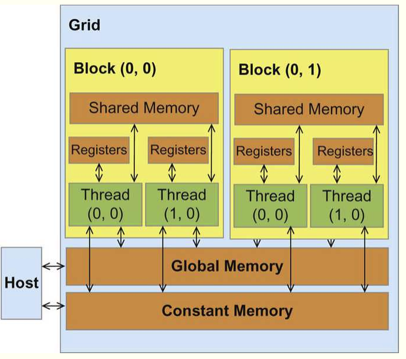
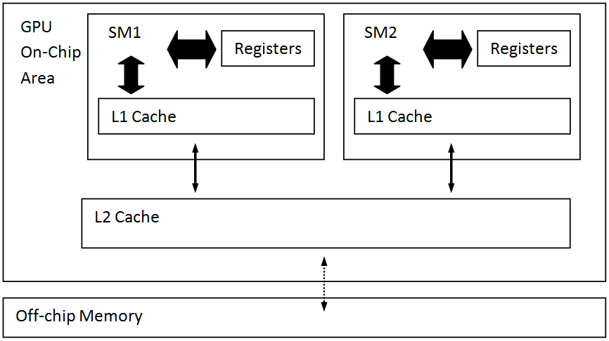
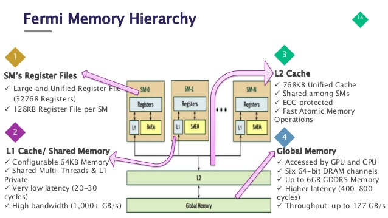
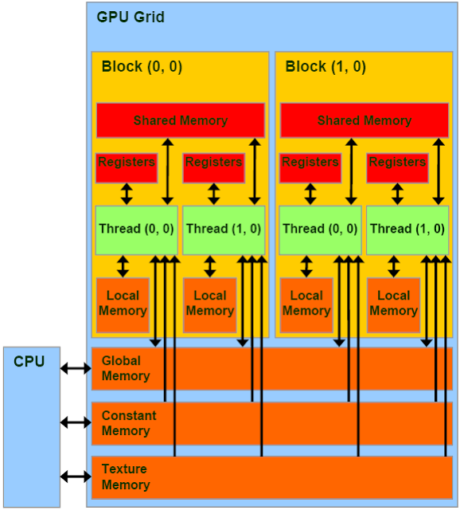

In this post, I talk about what happens when blocks are assigned to SMs, as well as CUDA code optimization across GPU architecture. Before this, I thought it was necessary to recap how CUDA's virtual architecure maps to the physical and vice-versa.

## Table Of Content

- Part 0. Review CUDA Physical and Virtual Architecture
- Part 1. Block Assignment
- Part 2. Can CUDA Code Be Optimized For All GPUs?

## Part 0. Review

### CUDA's Physical Architecture

#### SMs

CUDA-capable GPU cards are composed of one or more **Streaming Multiprocessors (SMs)**, which are an _abstraction_ of the underlying hardware.

#### cores

Each SM has a set of **Streaming Processors (SPs)**, also called CUDA cores, which **share a cache of shared memory** that is faster than the GPU’s global memory but that can only be accessed by the threads running on the SPs the that SM. These streaming processors are the “cores” that execute instructions.

#### cores/SM

The numbers of SPs/cores in an SM and the number of SMs depend on your device.

It is important to realize, however, that regardless of GPU model, there **are many more CUDA cores in a GPU than in a typical multicore CPU**: hundreds or thousands more. For example, the Kepler Streaming Multiprocessor design, dubbed SMX, contains 192 single-precision CUDA cores, 64 double-precision units, 32 special function units, and 32 load/store units.

#### warps, SM and cores

CUDA **cores are grouped together** to perform instructions in a **warp** of threads. Warp simply means a group of threads that are scheduled together to execute the same instructions in lockstep.

Depending on the model of GPU, the **cores** may be double or quadruple pumped so that they **execute one instruction on two or four threads** in as many clock cycles.

_For instance, Tesla devices use a group of 8 quadpumped cores to execute a single warp. If there are less than 32 threads scheduled in the warp, it will still take as long to execute the instructions._

All CUDA cards to date use a warp size of 32.

Each **SM** has at least one **warp scheduler**, which is responsible for executing 32 threads.

#### tiling

The programmer is responsible for ensuring that the threads are being assigned efficiently for code that is designed to run on the GPU. The assignment of threads is done virtually in the code using what is sometimes referred to as a ‘tiling’ scheme of blocks of threads that form a grid. Programmers define a kernel function that will be executed on the CUDA card using a particular tiling scheme.

### CUDA's Virtual Architecture

When programming in CUDA we work with blocks of threads and grids of blocks. What is the relationship between this virtual architecture and the CUDA card’s physical architecture?

#### block

When kernels are launched, each **block** in a grid is assigned to a **Streaming Multiprocessor**. This allows threads in a block to use **shared** memory. If a block doesn’t use the full resources of the SM then multiple blocks may be assigned at once. If all of the SMs are busy then the extra blocks will have to wait until a SM becomes free.

#### threads

_Once a block is assigned to an SM_, it’s threads are split into warps by the warp scheduler and executed on the CUDA cores.

Since the same instructions are executed on each thread in the warp simultaneously it’s generally a bad idea to have conditionals in kernel code. This type of code is sometimes called **divergent**: when some threads in a warp are unable to execute the same instruction as other threads in a warp, those threads are diverged and do no work.

#### warp's context switch

Due to the hugely increased number of registers, a **warp’s context (it’s registers, program counter etc.) stays on chip for the life of the warp**. This means there is no additional cost to switching between warps vs executing the next step of a given warp. This allows the GPU to switch to hide some of it’s memory latency by switching to a new warp while it waits for a costly read.

## Part 1. Block Assignment

1. Before a block is assgined to an SM, it's given all the resources it needs beforehands.

   These resources include:

   - shared memory

   - registers

   - a slot in the SM scheduler

   

1. Why not give blocks SPs too?

   - There are way more blocks than SPs!

1. Why don't we assign these resources after the block is assigned?

   First, more on CUDA runtime:

   #### Notes On CUDA Runtime

   - The runtime system:

     - maintains a list of blocks to be executed

     - assigns new blocks to SM as they compute previously assigned blocks

   - CUDA runtime automatically reduces the number of blocks assgined to each SM until resource usage is under limit.

   Then, coming back to the point that we have **zero-cost context switch for warps** now, preassign resources to blocks (which in terms of execution is a bunch of warps) will make it that when warps are scheduled, their resources are already on-chip. So effectively we can achieve **zero-cost scheduling**.

   Also, CUDA ensures that a block can begin execution only when the runtime system has secured all resources need for **all threads** in the block to complete execution. When a thread of a block is assigned to an execution resource, all other threads in the same block are also assigned to the same resource. This condition ensures the temporal proximity of all threads in a block and prevents excessive or indefinite waiting time during barrier synchronization. (more about barrier synchronization, see: [The CUDA Parallel Programming Model - 4. Syncthreads Examples](./cuda4-sync)). Otherwise, a thread that never arrives at the barrier synchronization point because it doesn't have access to the necessary resources can cause everyone else to wait forever.

## Part 2. Can CUDA Code Be Optimized For All GPUs?

This assumes that warp size is the same.

### first, what gets built by nvcc?

NVCC generates three types of code:

- Host object code (compiled with g++) -- **not** forward-compatible

- Device object code -- **not** forward-compatible

- Device assembly code (PTX) -- forward-compatible

Compiler produces a **fat binary** which includes all three types of code.

More on this at: http://on-demand.gputechconf.com/gtc/2013/webinar/cuda-toolkit-as-build-tool.pdf

### fat binaries

When a CUDA fat binary is run on a given GPU, a few scenarios can take place:

- If the fat binary includes object code compiled for the device architecture, that code is run directly.

- If the fat binary includes PTX assembly which the GPU understands, that code is Just-In-Time compiled and run on the GPU. (This will result in startup lag due to JIT compilation)

- If neither version are compatible with the GPU, the application doesn’t run.

Newer GPUs can run older PTX assembly code, but binary code from one architecture can't fun on another.

### compute capability and device architecture

Compute capability:

- defines the **computing features** supported by a given GPU generation

- language features (i.e. double precision floats, various functions)

- device features (size of shared memory, max thread block size)

GPU architecture:

- binary code is architecture-specific, and changes with each GPU generation

- version of ther object code

- different architecutres use different optimizations, etc.

### CUDA code optimized for one GPU might run inefficiently when executed on another

Optimizations can be applied at various levels

- overlapping data transfers with computation
- fine-tuning floating-point operation sequences
- ...

Now coming back to the question, we can try to answer from device features perspective. For instance, we don't know beforehand:

- size of shared memory

  - you might be under or over utilizing it

- architecture of shared memory (e.g. does it come with L1 cache or are they separate)

  - see the section below on shared memory

- is there an L2 cache?

  - see the section below on shared memory
  - in short, L2 cache provides on-chip memory that can prove quite handy when different SMs need to read the same data

- max thread block size

- number of SMs available

- how many cores there are on each SM

### more on shared memory

Shared memory benefits meny problems, but it's not appropriate for all problems.

- Some algorithms map naturally to shared memory

- Others require a cache

- Others require a combination of both.

#### (pretty old) Fermi memory hierarchy with both L1 and L2 cache

another picture showing the same architecture.

#### invisible cache

##### local memory

“Local” because each thread has its own private area

Details:

- Not really a “memory” – bytes are stored in **global memory**
- Differences from global memory:
  • Addressing is resolved by the compiler
  • Stores are **cached in L1**
- Used if the source code exceeds register limit

It could hurt performance in two ways:

- Increased memory traffic
- Increased instruction count

But Spilling/Local Memory usage isn’t always bad:

- Local memory bytes can get contained within L1
  - Avoids memory traffic increase
- Additional instructions don’t matter much if code is not instruction-throughput limited

#### NVIDIA unified memory

Traditional GPU architectures support a read-only "load" path for texture operations and a write-only "export" path for pixel data output, which is poorly suited to executing general purpose C or C++ thread programs that expect **reads and writes to be ordered**. For example: spilling a register operand to memory and then reading it back creats a **read after write hazard**.

This challenge is addressed by a single unified memory request path for loads and stores, with an L1 cache per SM multiprocessor and unified L2 cache that services all operations.

#### L1 cache

L1 cache is per-SM. It's configurable to support both shared memory and caching of local and global memory operations.

The L1 cache helps **caching temporary resgister** spills of complex programs.

In older generations, GPUs spilled registers directly to DRAM, increasing access latency.

With L1 cache, performance scales gracefully with increased temporary register usage.

#### L2 cache

L2 provides efficient, high-speed data sharing **across the GPU**.

- Algorithms for which data addresses are not known beforehand can especially benefit from the cache hierarchy.

- Kernels that require multiple SMs to read the same data also benefit from having an L2 cache.

#### Unified Cache Architecture

This unified design **allows the L1 cache to leverage resources**, increasing its bandwidth, and allows it to be reconfigured to grow larger when shared memory allocations are not using all of the shared memory capacity.

Furthermore, a configurable L1 cache can be as large as 64KB in size, combined with a 32KB per SM shared memory allocation, or it can be reduced to 32KB of L1 cache, allowing 64KB of allocation to be used for shared memory.

Combining the L1 data cache with the shared memory **reduces latency** and provides **higher bandwidth** than the L1 cache implementation used previously.
